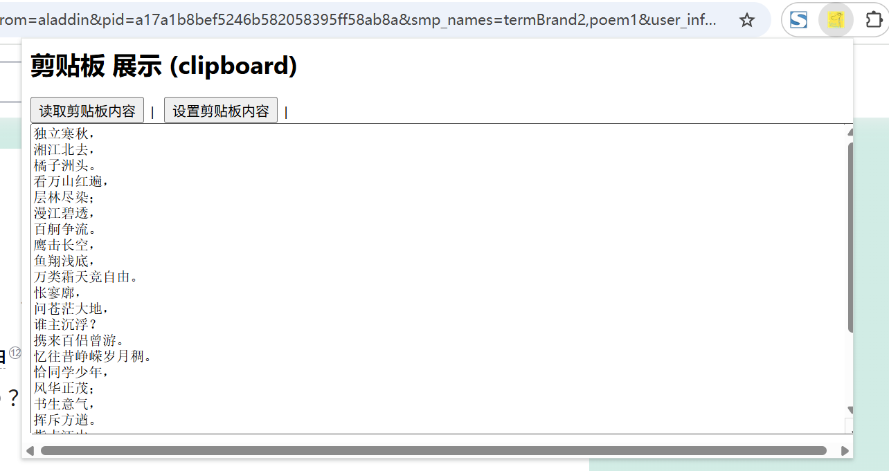

# navigator.clipboard 管理剪贴板功能展示

> Chrome 扩展程序中操作剪贴板主要使用 Web 标准的 `navigator.clipboard`（异步 Clipboard API）。
> 与普通网页不同，扩展程序想要读写剪贴板，需要在 `manifest.json` 中声明 `clipboardRead` / `clipboardWrite` 权限。
> 另外还有一个仅供 ChromeOS 使用的 `chrome.clipboard` API，用于设置剪贴板图片数据，普通桌面 Chrome 无法使用。

## 权限

- `clipboardWrite` 写入剪贴板
    允许扩展程序向剪贴板写入文本、图片等数据（`writeText()` / `write()`）。
    ```json
    "permissions": [
        "clipboardWrite"
    ]
    ```

- `clipboardRead` 读取剪贴板
    允许扩展程序读取剪贴板内容（`readText()` / `read()`）。读取剪贴板会带来隐私风险，安装时会向用户提示。
    ```json
    "permissions": [
        "clipboardRead"
    ]
    ```

> 说明：由于 Clipboard API 依赖文档焦点，一般在扩展程序的 **popup / options / side panel** 等可见页面中调用，而不是在 Service Worker 中调用。

## manifest.json 配置

```json
{
    "manifest_version": 3,
    "name": "剪贴板 展示 (clipboard)",
    "action": {
        "default_popup": "pages/action.html",
        "default_icon": "images/icon.png",
        "default_title": "展示 clipboard API"
    },
    "permissions": [
        "clipboardRead",
        "clipboardWrite"
    ]
}
```

## 方法

### readText()
> 读取剪贴板中的文本，返回 Promise<string>
```javascript
const text = await navigator.clipboard.readText();
console.log("剪贴板文本:", text);
```

### read()
> 读取剪贴板中的任意数据（文本、图片等），返回 Promise<ClipboardItem[]>
```javascript
const items = await navigator.clipboard.read();
for (const item of items) {
    for (const type of item.types) {
        // type 常见值: text/plain、text/html、image/png
        const blob = await item.getType(type);
        console.log("剪贴板类型:", type, blob);
    }
}
```

### writeText()
> 向剪贴板写入文本，返回 Promise<void>
```javascript
await navigator.clipboard.writeText("你好，剪贴板！");
console.log("文本已写入剪贴板");
```

### write()
> 向剪贴板写入任意数据，返回 Promise<void>
```javascript
const blob = new Blob(["Hello Clipboard"], { type: "text/plain" });
const item = new ClipboardItem({ "text/plain": blob });
await navigator.clipboard.write([item]);
console.log("数据已写入剪贴板");
```

### 写入图片示例
```javascript
// 以 canvas 生成的图片为例
const canvas = document.createElement("canvas");
canvas.width = 100;
canvas.height = 100;
const ctx = canvas.getContext("2d");
ctx.fillStyle = "#FF0000";
ctx.fillRect(0, 0, 100, 100);
const blob = await new Promise((resolve) => canvas.toBlob(resolve, "image/png"));
const item = new ClipboardItem({ "image/png": blob });
await navigator.clipboard.write([item]);
```

### chrome.clipboard（仅 ChromeOS）
> 设置剪贴板图片数据，需要 `clipboard` 权限
```javascript
chrome.clipboard.setImageData(
    imageData,          // ArrayBuffer，要设置的图片数据
    "png",              // 图片类型: "png" | "jpeg"
    { width: 100, height: 100 }, // 附加参数
    function() {
        if (chrome.runtime.lastError) {
            console.error("设置失败:", chrome.runtime.lastError.message);
        } else {
            console.log("图片已写入剪贴板");
        }
    }
);
```

## 事件

Clipboard API 没有提供专门的剪贴板变化事件。若需要监听剪贴板变化，可在 content script 中监听 `document` 的 `copy` / `cut` / `paste` 事件。

```javascript
// content script 中监听复制、剪切、粘贴
document.addEventListener("copy", (e) => {
    console.log("用户复制了内容:", e.target);
});
document.addEventListener("cut", (e) => {
    console.log("用户剪切了内容:", e.target);
});
document.addEventListener("paste", (e) => {
    console.log("粘贴内容:", e.clipboardData.getData("text"));
});
```

## 项目
> https://github.com/freewu/plugin-demo/blob/main/chrome-extension-demo/demo41/


## 资料
```
https://developer.chrome.com/docs/extensions/reference/api/clipboard?hl=zh-cn
https://developer.mozilla.org/zh-CN/docs/Web/API/Clipboard_API
https://github.com/GoogleChrome/chrome-extensions-samples/tree/main/api-samples/clipboard
```
