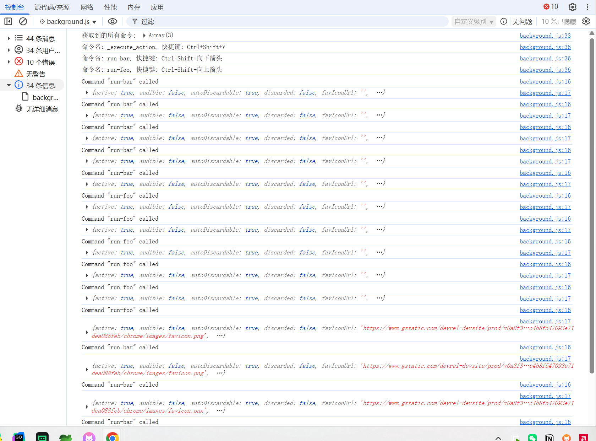

# chrome.commands 管理键盘快捷键功能展示

> 使用 `chrome.commands` API 为扩展程序添加快捷键（键盘快捷键），让用户通过按键快速触发扩展程序的功能。
> 快捷键在 `manifest.json` 的 `commands` 字段中声明，用户也可以在 `chrome://extensions/shortcuts` 页面自定义。
> 其中 `_execute_action` 是内置命令，用于触发扩展程序的 action（点击工具栏图标），无需在后台监听。

## manifest.json 配置

```json
{
    "manifest_version": 3,
    "name": "键盘快捷键 展示 (chrome.commands)",
    "commands": {
        "run-foo": {
            "suggested_key": {
                "default": "Ctrl+Shift+Up",
                "mac": "Command+Shift+Up"
            },
            "description": "Run \"foo\" on the current page."
        },
        "run-bar": {
            "suggested_key": "Ctrl+Shift+Down",
            "description": "Run \"bar\" on the current page."
        },
        "_execute_action": {
            "suggested_key": {
                "windows": "Ctrl+Shift+V",
                "mac": "Command+Shift+V",
                "chromeos": "Ctrl+Shift+V",
                "linux": "Ctrl+Shift+V"
            }
        }
    }
}
```

- `default` / `mac` / `windows` / `chromeos` / `linux`：针对不同平台设置默认快捷键，用户可覆盖。
- 一个扩展程序最多可以声明 **4 个** 推荐（suggested）快捷键，`_execute_action` 不占用这个数量。
- 快捷键必须包含 `Ctrl` 或 `Alt`（macOS 上为 `Command` 或 `Option`），且不能与浏览器保留快捷键冲突。

## 方法

### getAll()
> 返回扩展程序声明的所有命令
```javascript
const commands = await chrome.commands.getAll();
for (const command of commands) {
    console.log("命令名称:", command.name);         // 命令名称，内置命令为 "_execute_action"
    console.log("命令描述:", command.description);   // 命令描述
    console.log("快捷键:", command.shortcut);        // 当前用户设置的快捷键，未设置为空字符串
}
```

### update()
> 更新命令的快捷键（Chrome 110+）
```javascript
// 将 run-foo 命令的快捷键设置为 Ctrl+Shift+Y
await chrome.commands.update({
    name: "run-foo",
    shortcut: "Ctrl+Shift+Y"
}).catch((error) => {
    console.error("更新快捷键失败:", error);
});
```

### reset()
> 将命令的快捷键重置为 manifest 中声明的默认值（Chrome 110+）
```javascript
await chrome.commands.reset("run-foo").catch((error) => {
    console.error("重置快捷键失败:", error);
});
```

## 事件

### onCommand
> 当用户按下快捷键时触发。`_execute_action` 命令不会触发此事件
```javascript
chrome.commands.onCommand.addListener((command, tab) => {
    console.log("命令被触发:", command);
    console.log("当前标签页:", tab);
    switch (command) {
        case "run-foo":
            console.log("执行 foo");
            break;
        case "run-bar":
            console.log("执行 bar");
            break;
    }
});
```

## 项目
> https://github.com/freewu/plugin-demo/blob/main/chrome-extension-demo/demo14/


## 资料
```
https://developer.chrome.com/docs/extensions/reference/api/commands?hl=zh-cn
https://github.com/GoogleChrome/chrome-extensions-samples/tree/main/api-samples/commands
```
