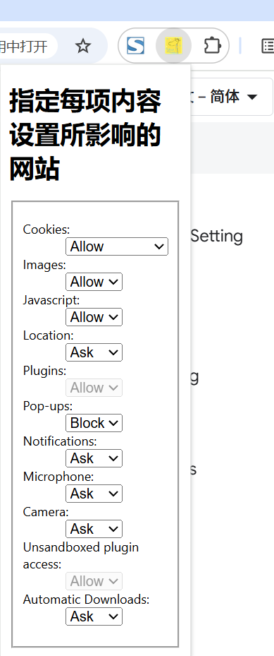

# chrome.contentSettings 管理内容设置功能展示

> 使用 `chrome.contentSettings` API 查询和修改 Chrome 的内容设置（例如是否允许网站使用 Cookie、JavaScript、摄像头、位置等）。
> 你可以全局设置，也可以按网站（模式）设置，从而精确控制每一项内容设置所影响的网站。
> 该 API 需要 `contentSettings` 权限。

## manifest.json 配置

```json
{
    "manifest_version": 3,
    "name": "指定每项内容设置所影响的网站 (chrome.contentSettings)",
    "permissions": [
        "contentSettings",
        "tabs"
    ]
}
```

## 内容设置类型

`chrome.contentSettings` 下包含多个子对象，每个子对象代表一类设置：

```
cookies             Cookie
images              图片
javascript          JavaScript
location            地理位置
notifications       通知
plugins             插件
popups              弹出式窗口
automaticDownloads  自动下载
camera              摄像头
microphone          麦克风
clipboard           剪贴板
sound               声音
```

## ContentSetting 对象

```javascript
{
    setting: "allow",   // allow | block | ask | session_only（部分类型支持）
    // 部分类型支持:
    // - "allow" | "block"
    // - location/notifications/camera/microphone 支持 "ask"
    // - cookies 支持 "session_only"
    primaryPattern: "https://*.example.com/*", // 主模式
    secondaryPattern: "<all_urls>",            // 次模式（部分类型支持）
    scope: "regular"                            // regular | incognito_session_only
}
```

## 方法

以下方法对每个内容设置子对象（如 `chrome.contentSettings.cookies`）都通用。

### get()
> 获取当前设置
```javascript
chrome.contentSettings.cookies.get({
    primaryUrl: "https://www.example.com/", // 要查询的主 URL
    // secondaryUrl: "https://www.example.com/", // 要查询的次要 URL（部分类型支持）
    // incognito: false // 是否查询无痕模式设置
}, (details) => {
    console.log("当前设置:", details.setting);
    console.log("主模式:", details.primaryPattern);
});
```

### set()
> 修改设置
```javascript
chrome.contentSettings.cookies.set({
    primaryPattern: "https://*.example.com/*", // 主模式（必填）
    // secondaryPattern: "<all_urls>",         // 次模式（部分类型支持）
    setting: "block",                          // 要设置的规则
    scope: "regular"                           // regular | incognito_session_only
}, () => {
    if (chrome.runtime.lastError) {
        console.error("设置失败:", chrome.runtime.lastError.message);
    } else {
        console.log("设置成功");
    }
});
```

```javascript
// 例如：阻止所有网站的图片
chrome.contentSettings.images.set({
    primaryPattern: "<all_urls>",
    setting: "block"
});
```

### clear()
> 清除设置，恢复到默认值
```javascript
chrome.contentSettings.cookies.clear({
    // scope: "regular" // 默认清除 regular 范围
}, () => {
    console.log("已清除设置");
});
```

### getResourceIdentifiers()（部分类型）
> 获取可用的资源标识符，如 `plugins` 类型的插件列表
```javascript
chrome.contentSettings.plugins.getResourceIdentifiers((identifiers) => {
    identifiers.forEach((id) => console.log(id.id, id.description));
});
```

## 事件

### onChange
> 设置发生变化时触发
```javascript
chrome.contentSettings.cookies.onChange.addListener((details) => {
    console.log("内容设置变化:", details);
    console.log("变化项:", details.setting);          // 当前值
    console.log("主模式:", details.primaryPattern);
    console.log("来源:", details.rule.source);        // 规则来源
});
```

## 项目
> https://github.com/freewu/plugin-demo/blob/main/chrome-extension-demo/demo22/


## 资料
```
https://developer.chrome.com/docs/extensions/reference/api/contentSettings?hl=zh-cn
https://github.com/GoogleChrome/chrome-extensions-samples/tree/main/api-samples/contentSettings
```
