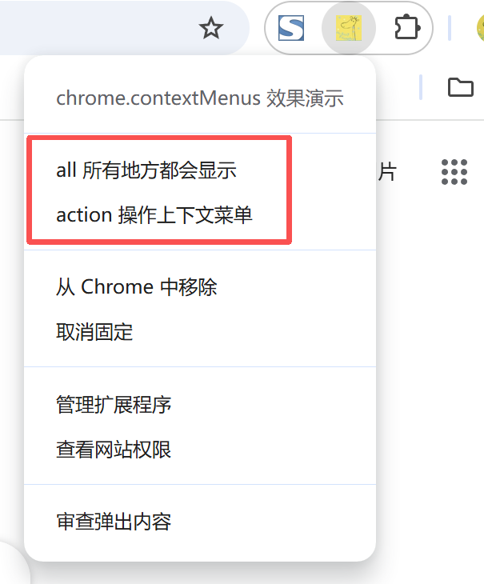

# chrome.contextMenus 管理右键菜单功能展示

> 使用 `chrome.contextMenus` API 向 Chrome 的右键（上下文）菜单中添加菜单项。
> 你可以根据点击的页面类型（页面、图片、链接、选中文本等）动态显示不同的菜单项，并在用户点击时执行相应逻辑。
> 注意：在 Manifest V3 的 Service Worker 中，创建菜单项时 **不能** 使用 `onclick` 属性，应改为监听 `chrome.contextMenus.onClicked` 事件。

## manifest.json 配置

```json
{
    "manifest_version": 3,
    "name": "chrome.contextMenus 效果演示",
    "permissions": [
        "contextMenus"
    ],
    "background": {
        "service_worker": "js/background.js"
    }
}
```

## 菜单项类型 ContextType

创建菜单项时可指定 `contexts`，只有匹配的上下文才会显示该菜单项：

```
all | page | frame | selection | link | editable | image | video | audio | launcher
```

例如：`contexts: ["image"]` 只在右键点击图片时显示；`contexts: ["selection"]` 只在选中文本时显示。

## 方法

### create()
> 创建新的上下文菜单项
```javascript
chrome.contextMenus.create({
    id: "demo-menu",          // 菜单项的唯一 ID，可用于后续更新/删除
    title: "测试菜单",         // 菜单显示的文字
    contexts: ["page", "selection"], // 显示该菜单项的上下文
    type: "normal",           // normal | checkbox | radio | separator，默认 normal
    enabled: true,            // 是否可点击
    visible: true             // 是否可见
}, function() {
    if (chrome.runtime.lastError) {
        console.error("创建菜单失败:", chrome.runtime.lastError.message);
    } else {
        console.log("菜单创建成功");
    }
});
```

#### 创建父菜单与子菜单
```javascript
// 父菜单
chrome.contextMenus.create({
    id: "parent",
    title: "父菜单",
    contexts: ["all"]
});
// 子菜单
chrome.contextMenus.create({
    id: "child",
    parentId: "parent",
    title: "子菜单项",
    contexts: ["all"]
});
```

### update()
> 更新已有的菜单项
```javascript
chrome.contextMenus.update("demo-menu", {
    title: "新的菜单标题",
    // type: "checkbox",   // 可切换类型
    // checked: true,      // checkbox / radio 的选中状态
    // contexts: ["image"],
    // parentId: "parent", // 移动菜单层级
    // visible: true,
    // enabled: true
}).then(() => {
    console.log("菜单已更新");
}).catch((error) => {
    console.error("更新菜单失败:", error);
});
```

### remove()
> 删除指定的菜单项（会同时删除其子菜单）
```javascript
chrome.contextMenus.remove("demo-menu").then(() => {
    console.log("菜单已删除");
}).catch((error) => {
    console.error("删除菜单失败:", error);
});
```

### removeAll()
> 删除扩展程序创建的所有菜单项
```javascript
chrome.contextMenus.removeAll().then(() => {
    console.log("所有菜单已删除");
});
```

## 事件

### onClicked
> 用户点击上下文菜单项时触发
```javascript
chrome.contextMenus.onClicked.addListener((info, tab) => {
    console.log("OnClickData:", info);
    console.log("menuItemId:", info.menuItemId);   // 被点击菜单项的 ID
    console.log("parentMenuItemId:", info.parentMenuItemId); // 父菜单 ID
    console.log("selectionText:", info.selectionText); // 选中的文本
    console.log("linkUrl:", info.linkUrl);         // 右键链接的地址
    console.log("srcUrl:", info.srcUrl);           // 图片/音视频的地址
    console.log("pageUrl:", info.pageUrl);         // 页面地址
    console.log("editable:", info.editable);       // 是否在可编辑元素上
    console.log("checked:", info.checked);         // checkbox / radio 是否被选中
    console.log("tab:", tab);
});
```

## 项目
> https://github.com/freewu/plugin-demo/blob/main/chrome-extension-demo/demo3/


## 资料
```
https://developer.chrome.com/docs/extensions/reference/api/contextMenus?hl=zh-cn
https://github.com/GoogleChrome/chrome-extensions-samples/tree/main/api-samples/contextMenus
```
