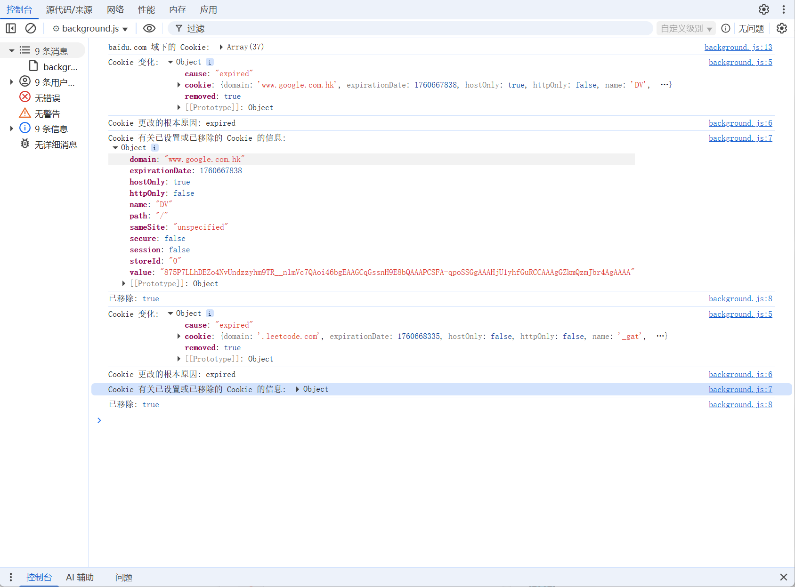

# chrome.cookies 管理 Cookie 功能展示

> 使用 `chrome.cookies` API 查询和修改浏览器的 Cookie。
> 查询 Cookie 需要 `cookies` 权限，并且要访问某个域名的 Cookie，扩展程序还必须拥有该域名的 **主机权限**（host permission）。
> 由于 Cookie 属于敏感数据，建议只申请必要的主机权限，而不是 `<all_urls>`。

## 权限

```json
{
    "permissions": [
        "cookies"
    ],
    "host_permissions": [
        "https://*.example.com/"
    ]
}
```

- `cookies` 权限授予对 `chrome.cookies` 命名空间的访问能力。
- 只有扩展程序拥有对应主机权限的域名，才能读取 / 写入其 Cookie。

## Cookie 对象

```javascript
{
    name: "session_id",        // Cookie 的名称
    value: "abc123",           // Cookie 的值
    domain: "example.com",     // Cookie 所属域名
    hostOnly: true,            // 是否为仅主机 Cookie
    path: "/",                 // Cookie 的路径
    secure: true,              // 是否仅通过 HTTPS 发送
    httpOnly: true,            // 是否禁止 JS 访问
    sameSite: "lax",           // no_restriction | lax | strict | unspecified
    session: false,            // 是否为会话 Cookie
    expirationDate: 1759218545,// 过期时间（秒，自 epoch 起）
    storeId: "0"               // Cookie 存储区 ID
}
```

## 方法

### get()
> 检索与给定信息匹配的单个 Cookie
```javascript
const cookie = await chrome.cookies.get({
    url: "https://www.example.com", // 必须提供，用于推断域名和路径
    name: "session_id"              // 要获取的 Cookie 名称
});
console.log("Cookie:", cookie);
```

### getAll()
> 检索匹配给定信息的所有 Cookie，结果按路径长度降序、创建时间升序排列
```javascript
const cookies = await chrome.cookies.getAll({
    domain: "example.com",  // 限定域名
    // name: "session_id",  // 可选，限定名称
    // url: "https://www.example.com",
    // secure: true,        // 仅返回 secure 的 Cookie
    // session: false,      // 仅返回非会话 Cookie
    // path: "/",           // 限定路径
    // storeId: "0"         // 限定存储区
});
console.log("匹配的 Cookie 数量:", cookies.length);
```

### set()
> 设置 Cookie；如果存在等效的 Cookie，可能会覆盖它
```javascript
const cookie = await chrome.cookies.set({
    url: "https://www.example.com",
    name: "demo_cookie",
    value: "hello",
    domain: "example.com",
    path: "/",
    secure: true,
    httpOnly: false,
    sameSite: "lax",
    expirationDate: Date.now() / 1000 + 3600 // 1 小时后过期
});
console.log("设置结果:", cookie);
```

### remove()
> 删除匹配的 Cookie，返回被删除 Cookie 的信息
```javascript
const removed = await chrome.cookies.remove({
    url: "https://www.example.com",
    name: "demo_cookie"
});
console.log("已删除:", removed);
```

### getAllCookieStores()
> 列出所有 Cookie 存储区（例如普通窗口与无痕窗口是不同的存储区）
```javascript
const stores = await chrome.cookies.getAllCookieStores();
for (const store of stores) {
    console.log("存储区 ID:", store.id);
    console.log("使用该存储区的标签页:", store.tabIds);
}
```

## 事件

### onChanged
> Cookie 被设置或删除时触发
```javascript
chrome.cookies.onChanged.addListener((changeInfo) => {
    console.log("Cookie 变化:", changeInfo);
    console.log("变化原因:", changeInfo.cause); // evicted | expired | explicit | expired_overwrite | overwrite
    console.log("被移除:", changeInfo.removed); // 删除为 true，设置为 false
    console.log("Cookie:", changeInfo.cookie);
});
```

## 项目
> https://github.com/freewu/plugin-demo/blob/main/chrome-extension-demo/demo20/


## 资料
```
https://developer.chrome.com/docs/extensions/reference/api/cookies?hl=zh-cn
https://github.com/GoogleChrome/chrome-extensions-samples/tree/main/api-samples/cookies
```
