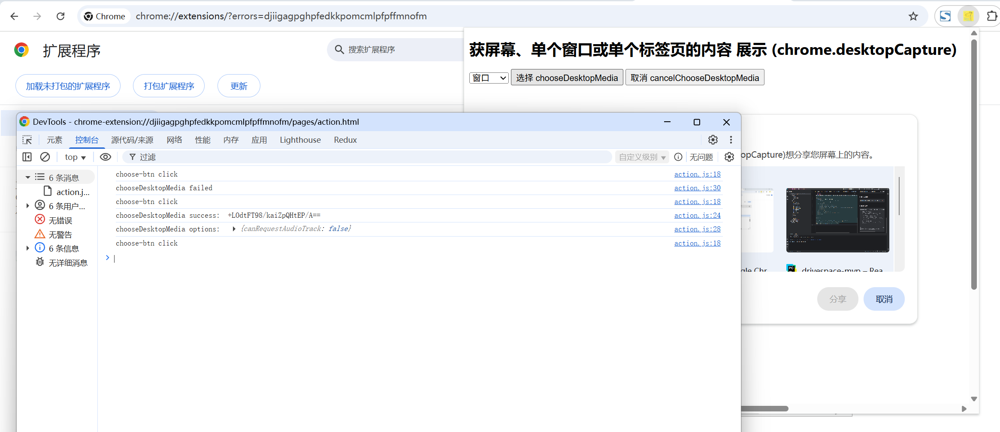

# chrome.desktopCapture 获屏幕、单个窗口或单个标签页的内容

> 使用 `chrome.desktopCapture` API 捕获屏幕、单个窗口或单个标签页的内容。
> 该 API 本身只负责 **获取媒体流 ID**，实际录制 / 截图需要配合 `navigator.mediaDevices.getUserMedia()` 或 **标签页捕获**。
> 出于安全考虑，获取屏幕共享必须在用户手势（如点击按钮）触发的可见上下文中调用。

## manifest.json 配置

```json
{
    "manifest_version": 3,
    "name": "获屏幕、单个窗口或单个标签页的内容 (chrome.desktopCapture)",
    "permissions": [
        "desktopCapture",
        "tabs"
    ]
}
```

## 方法

### chooseDesktopMedia()
> 显示供用户选择屏幕 / 窗口 / 标签页的对话框，返回媒体流 ID
```javascript
// sources 可选值: "screen" | "window" | "tab" | "audio"
// targetTab 可选，标识请求捕获的标签页
chrome.desktopCapture.chooseDesktopMedia(
    ["screen", "window", "tab"],
    (streamId) => {
        if (chrome.runtime.lastError) {
            console.error("获取失败:", chrome.runtime.lastError.message);
            return;
        }
        if (!streamId) {
            console.log("用户取消了选择");
            return;
        }
        console.log("媒体流 ID:", streamId);

        // 使用 streamId 获取媒体流（注意音频需要单独处理）
        navigator.mediaDevices.getUserMedia({
            video: {
                mandatory: {
                    chromeMediaSource: "desktop",
                    chromeMediaSourceId: streamId
                }
            }
            // audio: {
            //     mandatory: {
            //         chromeMediaSource: "desktop",
            //         chromeMediaSourceId: streamId
            //     }
            // }
        }).then((stream) => {
            // 将流绑定到 video 元素即可预览
            const video = document.createElement("video");
            video.srcObject = stream;
            video.autoplay = true;
            video.play();
        }).catch((error) => {
            console.error("获取媒体流失败:", error);
        });
    }
);
```

### cancelChooseDesktopMedia()
> 取消正在显示的桌面媒体选择对话框
```javascript
const requestId = chrome.desktopCapture.chooseDesktopMedia(["screen"], (streamId) => {
    console.log(streamId);
});
// 稍后取消
chrome.desktopCapture.cancelChooseDesktopMedia(requestId);
```

### getMediaStreamId()
> 直接获取媒体流 ID（用于在 Service Worker / offscreen 文档等场景），Chrome 116+
```javascript
chrome.desktopCapture.getMediaStreamId({
    targetTabId: 123 // 可选，要为其获取流 ID 的标签页
}, (streamId) => {
    console.log("媒体流 ID:", streamId);
});
```

## 说明

- `chooseDesktopMedia()` 的 `sources` 中 `"audio"` 表示共享标签页音频 / 系统音频（需要用户手动勾选「共享音频」）。
- 在 Manifest V3 中，`getUserMedia` 无法直接在 Service Worker 中调用，通常需要打开一个 **offscreen 文档** 或 popup 页面来承载视频流。
- 屏幕捕获必须在用户手势中发起，否则会失败。

## 项目
> https://github.com/freewu/plugin-demo/blob/main/chrome-extension-demo/demo23/


## 资料
```
https://developer.chrome.com/docs/extensions/reference/api/desktopCapture?hl=zh-cn
https://github.com/GoogleChrome/chrome-extensions-samples/tree/main/api-samples/desktopCapture
```
