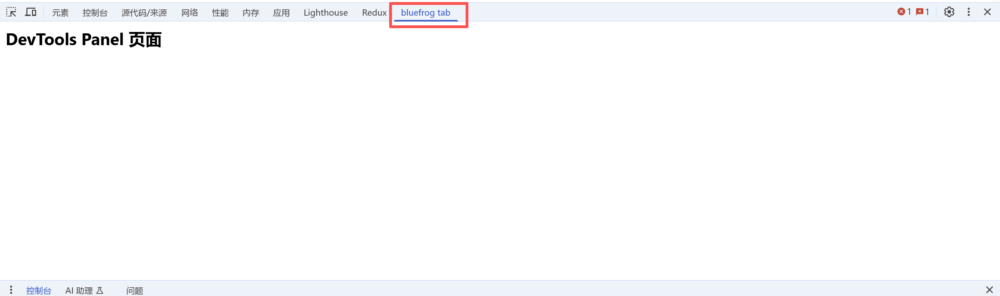

# chrome.devtools.panels 在开发者工具中创建自定义面板

> 使用 `chrome.devtools.panels` API 在 Chrome 开发者工具中创建自定义面板、侧边栏，或扩展 Elements / Sources 面板。
> 该 API 仅在扩展程序的 **DevTools 页面** 中可用，需要 `devtools_page`。

## manifest.json 配置

```json
{
    "manifest_version": 3,
    "name": "开发者工具 Panels 展示",
    "devtools_page": "pages/devtools.html",
    "background": {
        "service_worker": "js/background.js"
    }
}
```

## 属性

### panels.elements
> Elements 面板对象
```javascript
const elementsPanel = chrome.devtools.panels.elements;
elementsPanel.onSelectionChanged.addListener(() => {
    console.log("Elements 面板选中元素变化");
});
```

### panels.sources
> Sources 面板对象
```javascript
const sourcesPanel = chrome.devtools.panels.sources;
sourcesPanel.onSelectionChanged.addListener(() => {
    console.log("Sources 面板选中变化");
});
```

### panels.themeName
> 当前开发者工具的主题（`"dark"` / `"light"` / `"default"`）
```javascript
console.log("主题:", chrome.devtools.panels.themeName);
```

## 方法

### create()
> 创建一个新的开发者工具面板（标签页）
```javascript
chrome.devtools.panels.create(
    "My Panel",              // 面板标题
    "images/icon.png",       // 面板图标（16x16）
    "pages/panel.html",      // 面板 HTML 页面
    (panel) => {
        panel.onShown.addListener((window) => {
            console.log("面板已显示", window);
        });
        panel.onHidden.addListener(() => {
            console.log("面板已隐藏");
        });
    }
);
```

### createSidebarPane()
> 在 Elements 面板中创建一个侧边栏
```javascript
chrome.devtools.panels.elements.createSidebarPane(
    "My Sidebar",
    (sidebar) => {
        // 用页面内容填充
        sidebar.setPage("pages/sidebar.html");
        // 或者设置表达式
        // sidebar.setExpression("document.querySelector('h1').textContent");
        // 或者设置对象
        // sidebar.setObject({ a: 1, b: 2 });
        sidebar.setHeight("200px");
    }
);
```

### setOpenResourceHandler()
> 设置当用户点击资源链接时的处理函数
```javascript
chrome.devtools.panels.setOpenResourceHandler((resource, lineNumber) => {
    console.log("打开资源:", resource.url, "行:", lineNumber);
});
```

## 面板对象

### ExtensionPanel
```javascript
panel.onShown.addListener((window) => { ... });
panel.onHidden.addListener(() => { ... });
```

### ElementsPanel / SourcesPanel
```javascript
elementsPanel.onSelectionChanged.addListener(() => { ... });
elementsPanel.createSidebarPane("Title", (sidebar) => { ... });
```

### ExtensionSidebarPane
```javascript
sidebar.setPage("pages/sidebar.html");   // 使用页面作为内容
sidebar.setExpression("document.title"); // 使用表达式结果
sidebar.setObject({ key: "value" });     // 使用对象
sidebar.setHeight("150px");              // 设置高度
sidebar.onShown.addListener((window) => { ... });
sidebar.onHidden.addListener(() => { ... });
```

## 事件

### onThemeChanged
> 开发者工具主题变化时触发
```javascript
chrome.devtools.panels.onThemeChanged.addListener((themeName) => {
    console.log("主题变化:", themeName);
});
```

## 使用示例：创建带表单的面板

```javascript
// devtools.js
chrome.devtools.panels.create("扩展面板", "images/icon.png", "pages/panel.html", (panel) => {
    panel.onShown.addListener((panelWindow) => {
        // panelWindow 即面板的 window 对象
        const btn = panelWindow.document.getElementById("run-btn");
        btn?.addEventListener("click", () => {
            chrome.devtools.inspectedWindow.eval("document.title", (result) => {
                panelWindow.document.getElementById("output").textContent = result;
            });
        });
    });
});
```

## 说明

- `create()` 创建的面板会出现在开发者工具的顶部标签栏中。
- 面板 HTML 页面拥有 `chrome.devtools.*` 的全部能力。
- 侧边栏尺寸有限，`setHeight()` 可控制高度（支持像素或相对值）。

## 项目
> https://github.com/freewu/chrome-extension-cookbook-v3/blob/main/code/4-devtools-demo/


## 资料
```
https://developer.chrome.com/docs/extensions/reference/api/devtools/panels?hl=zh-cn
https://github.com/GoogleChrome/chrome-extensions-samples/tree/main/api-samples/devtools/panels
```
