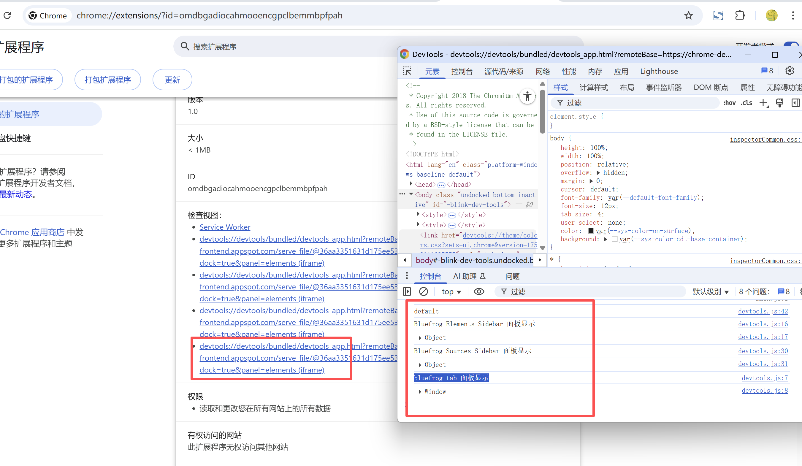

# chrome.devtools.performance 分析和优化网页性能

> 使用 `chrome.devtools.performance` API 获取被检查页面的性能指标（Metrics），以及监听性能分析（Profiling）的开始与结束。
> 该 API 仅在扩展程序的 **DevTools 页面** 中可用，需要 `devtools_page`。

## manifest.json 配置

```json
{
    "manifest_version": 3,
    "name": "开发者工具 Performance 展示",
    "devtools_page": "pages/devtools.html",
    "background": {
        "service_worker": "js/background.js"
    }
}
```

## Metric 对象

```javascript
{
    name: "Timestamp",     // 指标名称
    value: 123456.789      // 指标值
}
```

常见的指标名称包括：

```
Timestamp          时间戳
Documents          文档数量
Frames             框架数量
JSEventListeners   JS 事件监听器数量
Nodes              DOM 节点数量
LayoutCount        布局次数
RecalcStyleCount   样式重算次数
LayoutDuration     布局耗时（秒）
RecalcStyleDuration 样式重算耗时（秒）
ScriptDuration     脚本执行耗时（秒）
TaskDuration       任务总耗时（秒）
JSHeapUsedSize     JS 堆已用大小（字节）
JSHeapTotalSize    JS 堆总大小（字节）
```

## 方法

### getMetrics()
> 获取当前页面的性能指标
```javascript
chrome.devtools.performance.getMetrics((metrics) => {
    for (const metric of metrics) {
        console.log(metric.name, "=", metric.value);
    }
});

// Promise 写法（Chrome 114+）
const metrics = await chrome.devtools.performance.getMetrics();
const heap = metrics.find((m) => m.name === "JSHeapUsedSize");
console.log("JS 堆已用:", (heap.value / 1024 / 1024).toFixed(2), "MB");
```

## 事件

### onProfilingStarted
> 性能分析开始时触发（如点击 Performance 面板的录制按钮）
```javascript
chrome.devtools.performance.onProfilingStarted.addListener(() => {
    console.log("性能分析已开始");
});
```

### onProfilingStopped
> 性能分析结束时触发
```javascript
chrome.devtools.performance.onProfilingStopped.addListener(() => {
    console.log("性能分析已结束");
    // 此时可以获取最终指标
    chrome.devtools.performance.getMetrics((metrics) => {
        console.log("最终指标:", metrics);
    });
});
```

## 使用示例：性能分析前后对比

```javascript
// 在 devtools 页面中
let startMetrics = null;

chrome.devtools.performance.onProfilingStarted.addListener(() => {
    chrome.devtools.performance.getMetrics((metrics) => {
        startMetrics = metrics;
    });
});

chrome.devtools.performance.onProfilingStopped.addListener(() => {
    chrome.devtools.performance.getMetrics((metrics) => {
        if (!startMetrics) return;
        const before = Object.fromEntries(startMetrics.map((m) => [m.name, m.value]));
        for (const metric of metrics) {
            const delta = metric.value - (before[metric.name] ?? 0);
            if (delta > 0) {
                console.log(metric.name, "变化:", delta.toFixed(3));
            }
        }
    });
});
```

## 说明

- 指标为累计值，若要分析某段时间的性能，需要记录开始与结束时的差值。
- `JSHeapUsedSize` / `JSHeapTotalSize` 单位为字节。
- 该 API 只能在 DevTools 页面中使用。

## 项目
> https://github.com/freewu/chrome-extension-cookbook-v3/blob/main/code/4-devtools-demo/


## 资料
```
https://developer.chrome.com/docs/extensions/reference/api/devtools/performance?hl=zh-cn
https://developer.chrome.com/docs/devtools/performance/
```
