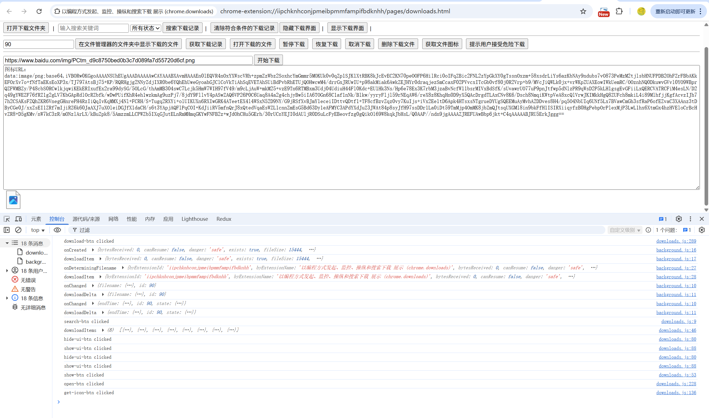

# chrome.downloads 管理下载功能展示

> 使用 `chrome.downloads` API 以编程方式发起、监控、操纵和搜索下载。
> 你可以触发下载、暂停 / 恢复、取消、删除文件、清除下载历史、获取文件图标等。
> 从 Chrome 120 开始，扩展程序也可以使用 `downloads.ui`（隐藏下载界面）和 `downloads.open`（打开下载文件）等权限。

## 权限

```json
{
    "permissions": [
        "downloads",
        "downloads.ui",
        "downloads.open"
    ]
}
```

- `downloads`：访问 `chrome.downloads` 命名空间。
- `downloads.ui`：调用 `setUiOptions()` 控制下载界面显示 / 隐藏。
- `downloads.open`：调用 `open()` 打开已下载的文件。

## DownloadQuery

`search()` / `erase()` 使用 `DownloadQuery` 过滤下载项，常用字段：

```javascript
{
    id: 123,                       // 下载项 ID
    filename: "test.txt",          // 绝对本地路径
    filenameRegex: "\\.txt$",      // 文件名正则
    url: "https://...",            // 初始 URL
    urlRegex: "https://...",       // URL 正则
    finalUrl: "https://...",       // 重定向后的最终 URL
    finalUrlRegex: "...",          // 最终 URL 正则
    state: "complete",             // in_progress | interrupted | complete
    paused: true,                  // 是否暂停
    danger: "safe",                // 危险类型
    mime: "text/plain",            // MIME 类型
    exists: true,                  // 文件是否存在
    query: ["keyword"],            // 搜索词（filename/url/finalUrl）
    startedAfter: "2024-01-01T00:00:00Z",
    endedBefore: "2024-01-01T00:00:00Z",
    totalBytesGreater: 1024,
    orderBy: ["-startTime"],       // 排序，- 表示降序
    limit: 100                     // 返回数量上限，默认 1000，0 表示全部
}
```

## 方法

### download()
> 下载指定 URL 的文件，成功返回下载项 ID
```javascript
chrome.downloads.download({
    url: "https://www.example.com/file.zip",
    filename: "demo/file.zip",     // 相对「下载」目录的路径
    conflictAction: "uniquify",    // uniquify | overwrite | prompt
    saveAs: false,                 // 是否弹出「另存为」对话框
    // method: "GET",              // GET | POST
    // headers: [{ name: "Authorization", value: "Bearer xxx" }],
    // body: "key=value"
}, (downloadId) => {
    if (chrome.runtime.lastError) {
        console.error("下载失败:", chrome.runtime.lastError.message);
    } else {
        console.log("下载已开始，ID:", downloadId);
    }
});
```

### search()
> 查询匹配的 DownloadItem
```javascript
const items = await chrome.downloads.search({
    state: "complete",
    orderBy: ["-startTime"],
    limit: 100
});
for (const item of items) {
    console.log(item.id, item.filename, item.state);
}
```

### pause() / resume()
> 暂停或恢复下载
```javascript
await chrome.downloads.pause(123).catch((e) => console.error(e));
await chrome.downloads.resume(123).catch((e) => console.error(e));
```

### cancel()
> 取消下载（不删除已下载的文件）
```javascript
await chrome.downloads.cancel(123);
```

### erase()
> 从历史记录中清除匹配的下载项，但 **不删除文件**；空对象表示清除所有历史记录
```javascript
await chrome.downloads.erase({ id: 123 });
// 清除所有
await chrome.downloads.erase({});
```

### removeFile()
> 删除已下载的文件
```javascript
await chrome.downloads.removeFile(123).catch((e) => console.error(e));
```

### open()
> 打开已下载的文件，需要 `downloads.open` 权限，且必须由用户手势触发
```javascript
chrome.downloads.open(123);
```

### show()
> 在文件管理器中显示下载的文件
```javascript
chrome.downloads.show(123);
```

### showDefaultFolder()
> 打开系统默认的「下载」文件夹
```javascript
chrome.downloads.showDefaultFolder();
```

### getFileIcon()
> 获取指定下载项的图标 URL
```javascript
chrome.downloads.getFileIcon(123, { size: 32 }, (iconUrl) => {
    console.log("图标 URL:", iconUrl);
});
```

### acceptDanger()
> 提示用户接受危险下载，必须在可见上下文中调用
```javascript
chrome.downloads.acceptDanger(123);
```

### setUiOptions()
> 控制下载界面的显示，需要 `downloads.ui` 权限
```javascript
chrome.downloads.setUiOptions({ enabled: false }); // 隐藏下载界面
chrome.downloads.setUiOptions({ enabled: true });  // 显示下载界面
```

## 事件

### onCreated
> 下载开始时触发
```javascript
chrome.downloads.onCreated.addListener((downloadItem) => {
    console.log("下载已创建:", downloadItem.id, downloadItem.url);
});
```

### onChanged
> 下载项属性变化时触发
```javascript
chrome.downloads.onChanged.addListener((downloadDelta) => {
    console.log("下载变化:", downloadDelta.id);
    if (downloadDelta.state) {
        console.log("状态:", downloadDelta.state.previous, "->", downloadDelta.state.current);
    }
    if (downloadDelta.error) {
        console.log("错误:", downloadDelta.error.current);
    }
});
```

### onErased
> 下载项从历史记录中清除时触发
```javascript
chrome.downloads.onErased.addListener((downloadId) => {
    console.log("下载记录已清除:", downloadId);
});
```

### onDeterminingFilename
> 在确定文件名时触发，可调用 `suggest()` 建议文件名
```javascript
chrome.downloads.onDeterminingFilename.addListener((downloadItem, suggest) => {
    console.log("正在确定文件名:", downloadItem.filename);
    suggest({ filename: "my-file.txt", conflictAction: "uniquify" });
    return true; // 返回 true 表示将异步调用 suggest
});
```

## 项目
> https://github.com/freewu/plugin-demo/blob/main/chrome-extension-demo/demo36/


## 资料
```
https://developer.chrome.com/docs/extensions/reference/api/downloads?hl=zh-cn
https://github.com/GoogleChrome/chrome-extensions-samples/tree/main/api-samples/downloads
```
