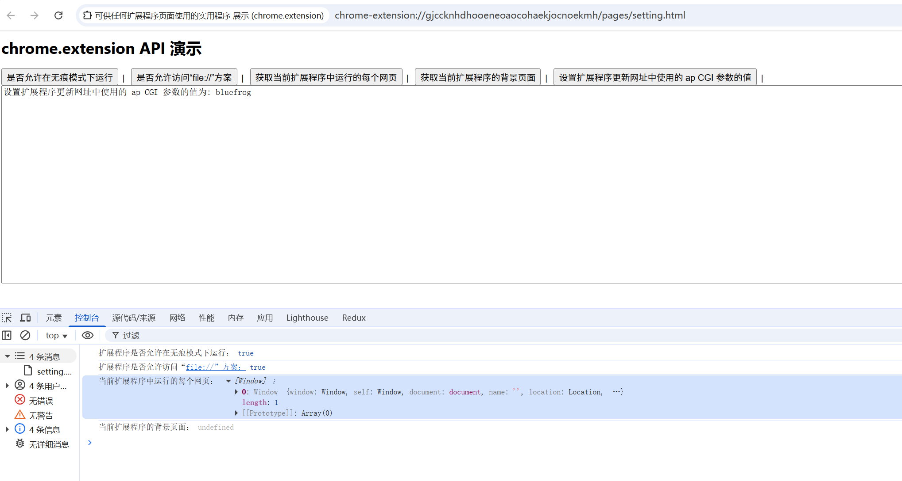

# chrome.extension 可供任何扩展程序页面使用的实用程序

> `chrome.extension` API 提供一组可供任何扩展程序页面使用的实用程序。
> 在 Manifest V3 中，该命名空间的大部分功能已被 `chrome.runtime` 取代或废弃；理解它有助于阅读旧代码和迁移扩展程序。

## 属性

### lastError
> 上一次运行时错误（已被 `chrome.runtime.lastError` 取代）
```javascript
console.log(chrome.extension.lastError);
```

### inIncognitoContext
> 当前脚本是否运行在无痕模式上下文中
```javascript
console.log("是否无痕上下文:", chrome.extension.inIncognitoContext);
```

## 方法

### getURL()
> 将相对路径转换为扩展程序的绝对 URL
```javascript
const url = chrome.extension.getURL("images/icon.png");
console.log(url); // chrome-extension://<id>/images/icon.png
```

### getViews()
> 获取扩展程序的所有页面视图（后台页、popup 等）
```javascript
const views = chrome.extension.getViews({ type: "popup" });
console.log("popup 视图数量:", views.length);
views.forEach((win) => console.log(win.location.href));
```

### getBackgroundPage()
> 获取后台页面（Manifest V2）
```javascript
const backgroundPage = chrome.extension.getBackgroundPage();
if (backgroundPage) {
    backgroundPage.doSomething();
}
```

### isAllowedIncognitoAccess()
> 查询扩展程序是否允许在无痕模式下运行
```javascript
chrome.extension.isAllowedIncognitoAccess((isAllowed) => {
    console.log("是否允许无痕访问:", isAllowed);
});
```

### isAllowedFileSchemeAccess()
> 查询扩展程序是否有权访问 `file://` 文件
```javascript
chrome.extension.isAllowedFileSchemeAccess((isAllowed) => {
    console.log("是否允许访问本地文件:", isAllowed);
});
```

### sendMessage()
> 向其他扩展程序 / 上下文发送消息（已被 `chrome.runtime.sendMessage` 取代）
```javascript
chrome.extension.sendMessage({ hello: "world" }, (response) => {
    console.log("响应:", response);
});
```

### getExtensionTabs()（已废弃）
> 获取扩展程序在某个窗口中的标签页
```javascript
chrome.extension.getExtensionTabs(windowId, (tabs) => {
    console.log(tabs);
});
```

## 事件

### onConnect / onConnectExternal
> 有连接建立时触发（已被 `chrome.runtime.onConnect` / `onConnectExternal` 取代）
```javascript
chrome.extension.onConnect.addListener((port) => {
    console.log("连接:", port.name);
    port.onMessage.addListener((msg) => console.log(msg));
});
```

### onMessage / onMessageExternal
> 收到消息时触发（已被 `chrome.runtime.onMessage` / `onMessageExternal` 取代）
```javascript
chrome.extension.onMessage.addListener((message, sender, sendResponse) => {
    console.log("收到消息:", message);
    sendResponse({ ok: true });
    return true;
});
```

## 迁移到 chrome.runtime

| chrome.extension | 推荐改用 |
| ---------------- | -------- |
| `getURL()` | `chrome.runtime.getURL()` |
| `sendMessage()` | `chrome.runtime.sendMessage()` |
| `onMessage` | `chrome.runtime.onMessage` |
| `onConnect` | `chrome.runtime.onConnect` |
| `getViews()` | `chrome.runtime.getContexts()`（Chrome 116+） |
| `getBackgroundPage()` | 改用 message 通信 |

## 项目
> https://github.com/freewu/plugin-demo/blob/main/chrome-extension-demo/demo42/


## 资料
```
https://developer.chrome.com/docs/extensions/reference/api/extension?hl=zh-cn
https://developer.chrome.com/docs/extensions/reference/api/runtime?hl=zh-cn
```
