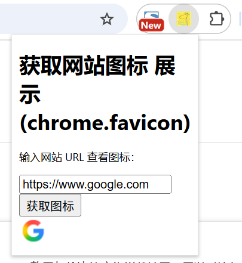

# chrome.favicon 获取网站图标

> Chrome 为扩展程序提供了一个内置的 `_favicon/` 页面，可以安全地获取指定网站的图标（favicon），无需自行请求网络。
> 该功能需要 `favicon` 权限。它并不是一个 `chrome.favicon.*` 方法集合，而是通过构造特殊 URL 来使用。

## manifest.json 配置

```json
{
    "manifest_version": 3,
    "name": "获取网站图标 展示 (chrome.favicon)",
    "permissions": [
        "favicon",
        "tabs"
    ],
    "action": {
        "default_popup": "pages/action.html",
        "default_icon": "images/icon.png"
    }
}
```

## 用法

### 构造 favicon URL
```javascript
function faviconURL(u) {
    const url = new URL(chrome.runtime.getURL("/_favicon/"));
    url.searchParams.set("pageUrl", u); // 目标页面 URL
    url.searchParams.set("size", "32"); // 图标尺寸
    return url.toString();
}

// 生成结果类似：
// chrome-extension://EXTENSION_ID/_favicon/?pageUrl=https%3A%2F%2Fwww.google.com&size=32
console.log(faviconURL("https://www.google.com"));
```

### 在页面中展示
```javascript
const img = document.createElement("img");
img.src = faviconURL("https://www.google.com");
document.getElementById("result-container").appendChild(img);
```

### 完整的 popup 示例
```html
<!doctype html>
<html lang="zh-CN">
<body>
    <h1>获取网站图标 展示 (chrome.favicon)</h1>
    <input type="text" id="url-input" value="https://www.google.com" placeholder="输入网站 URL">
    <button id="get-favicon-btn">获取图标</button>
    <div id="result-container"></div>
    <script src="../js/action.js" type="module"></script>
</body>
</html>
```

```javascript
// js/action.js
function faviconURL(u) {
    const url = new URL(chrome.runtime.getURL("/_favicon/"));
    url.searchParams.set("pageUrl", u);
    url.searchParams.set("size", "32");
    return url.toString();
}

document.getElementById("get-favicon-btn").addEventListener("click", () => {
    const urlInput = document.getElementById("url-input").value;
    if (urlInput) {
        const img = document.createElement("img");
        img.src = faviconURL(urlInput);
        document.getElementById("result-container").appendChild(img);
    } else {
        document.getElementById("result-container").textContent = "请输入网站 URL";
    }
});
```

## 参数

| 参数 | 说明 |
| ---- | ---- |
| `pageUrl` | 要获取图标的目标页面 URL（必填） |
| `size` | 图标尺寸，可选 `16`、`32`、`64`，默认 `16` |

## 说明

- 使用 `_favicon/` 不需要目标网站的主机权限，Chrome 会从内部缓存中返回图标。
- 返回的 URL 只能用于 `` 等展示场景，不能用于抓取文件内容。
- 如果没有可用图标，会返回一个默认的占位图标。
- 该功能没有事件。

## 项目
> https://github.com/freewu/plugin-demo/blob/main/chrome-extension-demo/demo32/


## 资料
```
https://developer.chrome.com/docs/extensions/how-to/ui/favicons?hl=zh-cn
https://developer.chrome.com/docs/extensions/reference/permissions-list?hl=zh-cn#favicon
```
