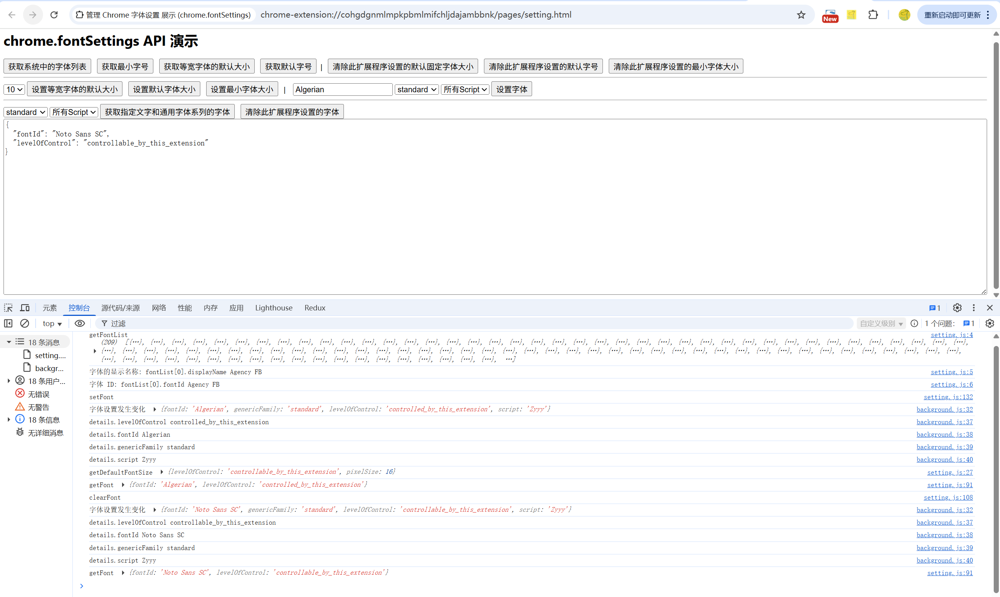

# chrome.fontSettings 管理 Chrome 的字体设置

> 使用 `chrome.fontSettings` API 管理 Chrome 的字体设置，包括各类字体族、字号、最小字号等。
> 该 API 需要 `fontSettings` 权限。所有设置都是 `ChromeSetting` 类型，提供 `get()` / `set()` / `clear()` 和 `onChange` 事件。

## manifest.json 配置

```json
{
    "manifest_version": 3,
    "name": "管理 Chrome 字体设置 展示 (chrome.fontSettings)",
    "permissions": [
        "fontSettings"
    ],
    "background": {
        "service_worker": "js/background.js"
    }
}
```

## 字体族与字号

字体族（`GenericFontFamily`）：
```
standard    标准字体
sansserif   无衬线字体
serif       衬线字体
fixed       等宽字体
math        数学字体
```

脚本（`ScriptCode`）：`Hrkt`、`Jpan`、`Hang`、`Hans`、`Hant`、`Cyrl`、`Grek`、`Arab` 等，用于指定字体适用的书写系统。

## 方法

### getFont()
> 获取指定字体族的设置
```javascript
chrome.fontSettings.getFont(
    { genericFamily: "standard" }, // details
    (details) => {
        console.log("字体 ID:", details.fontId);
        console.log("控制级别:", details.levelOfControl);
    }
);
```

### setFont()
> 设置指定字体族的字体
```javascript
chrome.fontSettings.setFont({
    genericFamily: "standard",
    fontId: "Microsoft YaHei"
}, () => {
    if (chrome.runtime.lastError) {
        console.error("设置失败:", chrome.runtime.lastError.message);
    } else {
        console.log("字体已设置");
    }
});
```

### clearFont()
> 清除字体设置，恢复默认
```javascript
chrome.fontSettings.clearFont({ genericFamily: "standard" }, () => {
    console.log("已恢复默认字体");
});
```

### getFontList()
> 获取系统可用的字体列表（按字体 ID 分组）
```javascript
chrome.fontSettings.getFontList((fonts) => {
    for (const font of fonts) {
        console.log("字体 ID:", font.fontId);
        console.log("显示名称:", font.displayName);
        console.log("支持语言:", font.fontId);
    }
});
```

### getDefaultFontSize() / setDefaultFontSize() / clearDefaultFontSize()
> 默认字号设置
```javascript
// 获取
chrome.fontSettings.getDefaultFontSize({}, (details) => {
    console.log("默认字号:", details.pixelSize);
});

// 设置
chrome.fontSettings.setDefaultFontSize({ pixelSize: 18 }, () => {
    console.log("字号已设置");
});

// 清除
chrome.fontSettings.clearDefaultFontSize({}, () => {
    console.log("已恢复默认");
});
```

### getDefaultFixedFontSize() / setDefaultFixedFontSize() / clearDefaultFixedFontSize()
> 等宽字体字号
```javascript
chrome.fontSettings.setDefaultFixedFontSize({ pixelSize: 14 });
```

### getMinimumFontSize() / setMinimumFontSize() / clearMinimumFontSize()
> 最小字号
```javascript
chrome.fontSettings.setMinimumFontSize({ pixelSize: 12 });
```

## 事件

### onFontChanged
> 字体设置变化时触发
```javascript
chrome.fontSettings.onFontChanged.addListener((details) => {
    console.log("字体变化:", details.fontId);
    console.log("字体族:", details.genericFamily);
    console.log("控制级别:", details.levelOfControl);
});
```

### onDefaultFontSizeChanged
> 默认字号变化时触发
```javascript
chrome.fontSettings.onDefaultFontSizeChanged.addListener((details) => {
    console.log("默认字号变化:", details.pixelSize);
});
```

### onDefaultFixedFontSizeChanged
> 等宽字体字号变化时触发
```javascript
chrome.fontSettings.onDefaultFixedFontSizeChanged.addListener((details) => {
    console.log("等宽字号变化:", details.pixelSize);
});
```

### onMinimumFontSizeChanged
> 最小字号变化时触发
```javascript
chrome.fontSettings.onMinimumFontSizeChanged.addListener((details) => {
    console.log("最小字号变化:", details.pixelSize);
});
```

## 项目
> https://github.com/freewu/plugin-demo/blob/main/chrome-extension-demo/demo37/


## 资料
```
https://developer.chrome.com/docs/extensions/reference/api/fontSettings?hl=zh-cn
https://github.com/GoogleChrome/chrome-extensions-samples/tree/main/api-samples/fontSettings
```
