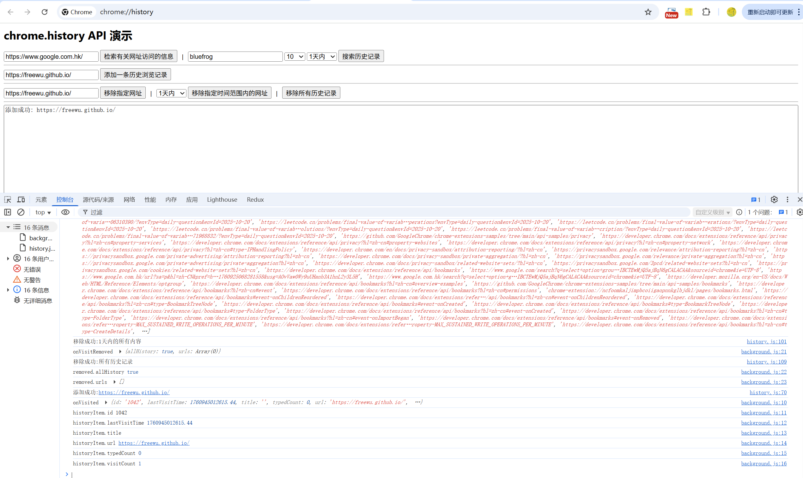

# chrome.history 管理用户的浏览器历史记录

> 使用 `chrome.history` API 与浏览器历史记录进行交互：搜索历史记录、添加或删除网址、获取访问记录等。
> 该 API 需要 `history` 权限，属于敏感权限，安装时会向用户提示。

## manifest.json 配置

```json
{
    "manifest_version": 3,
    "name": "浏览器历史记录管理 展示 (chrome.history)",
    "permissions": [
        "history"
    ],
    "background": {
        "service_worker": "js/background.js"
    }
}
```

## VisitItem / HistoryItem

```javascript
// HistoryItem
{
    id: "123",                 // 唯一 ID
    url: "https://example.com", // 网址
    title: "示例页面",          // 标题
    lastVisitTime: 1759218545, // 上次访问时间（毫秒，自 epoch 起）
    visitCount: 3,             // 访问次数
    typedCount: 1              // 用户手动输入地址访问的次数
}

// VisitItem
{
    id: "123",
    visitId: "456",            // 访问记录 ID
    visitTime: 1759218545,     // 访问时间（毫秒）
    referringVisitId: "0",     // 来源访问记录 ID
    transition: "link"         // 跳转类型
}
```

## 方法

### search()
> 搜索匹配的历史记录
```javascript
const items = await chrome.history.search({
    text: "chrome",            // 搜索关键字，空字符串表示所有
    startTime: Date.now() - 7 * 24 * 3600 * 1000, // 起始时间（毫秒）
    endTime: Date.now(),       // 结束时间
    maxResults: 100            // 返回数量上限，默认 100
});
for (const item of items) {
    console.log(item.lastVisitTime, item.title, item.url);
}
```

### getVisits()
> 获取指定 URL 的所有访问记录
```javascript
const visits = await chrome.history.getVisits({
    url: "https://www.example.com"
});
for (const visit of visits) {
    console.log(visit.visitId, visit.visitTime, visit.transition);
}
```

### addUrl()
> 向历史记录中添加一个网址
```javascript
await chrome.history.addUrl({ url: "https://www.example.com" });
console.log("已添加到历史记录");
```

### deleteUrl()
> 删除指定 URL 的所有历史记录
```javascript
await chrome.history.deleteUrl({ url: "https://www.example.com" });
```

### deleteRange()
> 删除指定时间范围内的历史记录
```javascript
await chrome.history.deleteRange({
    startTime: Date.now() - 24 * 3600 * 1000, // 24 小时前
    endTime: Date.now()
});
```

### deleteAll()
> 删除所有历史记录
```javascript
await chrome.history.deleteAll();
```

## 事件

### onVisited
> 用户访问某个页面时触发（在页面提交后，早于 `tabs.onUpdated` 的 complete 状态）
```javascript
chrome.history.onVisited.addListener((historyItem) => {
    console.log("访问了页面:", historyItem.url);
    console.log("标题:", historyItem.title);
    console.log("访问次数:", historyItem.visitCount);
});
```

### onVisitRemoved
> 当历史记录被删除时触发
```javascript
chrome.history.onVisitRemoved.addListener((removed) => {
    console.log("已删除历史记录:", removed);
    console.log("是否全部删除:", removed.allHistory);
    console.log("删除的网址:", removed.urls);
});
```

## 项目
> https://github.com/freewu/plugin-demo/blob/main/chrome-extension-demo/demo29/


## 资料
```
https://developer.chrome.com/docs/extensions/reference/api/history?hl=zh-cn
https://github.com/GoogleChrome/chrome-extensions-samples/tree/main/api-samples/history
```
