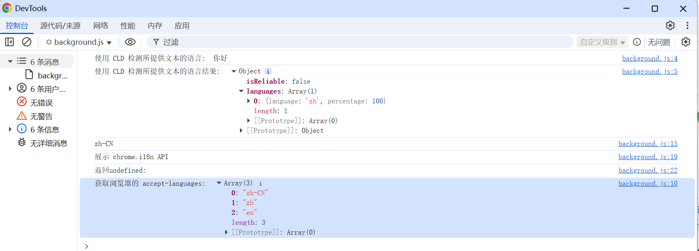

# chrome.i18n 国际化 API

> 使用 `chrome.i18n` API 为扩展程序提供多语言支持。
> 你可以在 `_locales/<locale>/messages.json` 中定义各语言的文案，然后在代码中用 `chrome.i18n.getMessage()` 读取，在 `manifest.json` 中用 `__MSG_key__` 引用。
> 需要在 manifest 中声明 `default_locale`。

## 目录结构

```
my-extension/
├── _locales/
│   ├── en/
│   │   └── messages.json
│   └── zh_CN/
│       └── messages.json
└── manifest.json
```

## manifest.json 配置

```json
{
    "manifest_version": 3,
    "name": "__MSG_extension_name__",
    "description": "__MSG_extension_description__",
    "default_locale": "en",
    "action": {
        "default_title": "__MSG_extension_title__"
    }
}
```

## messages.json 格式

`_locales/en/messages.json`
```json
{
    "extension_name": {
        "message": "My Extension"
    },
    "extension_description": {
        "message": "A demo extension."
    },
    "greeting": {
        "message": "Hello, $NAME$!",
        "placeholders": {
            "name": {
                "content": "$1",
                "example": "World"
            }
        }
    }
}
```

`_locales/zh_CN/messages.json`
```json
{
    "extension_name": {
        "message": "我的扩展程序"
    },
    "extension_description": {
        "message": "一个演示扩展程序。"
    },
    "greeting": {
        "message": "你好，$NAME$！",
        "placeholders": {
            "name": {
                "content": "$1",
                "example": "世界"
            }
        }
    }
}
```

## 方法

### getMessage()
> 根据当前语言环境获取本地化字符串
```javascript
// 简单用法
const greeting = chrome.i18n.getMessage("greeting", ["World"]);
// en: "Hello, World!"  zh_CN: "你好，世界！"
console.log(greeting);

// 不传参数
const name = chrome.i18n.getMessage("extension_name");
console.log(name);
```

### getUILanguage()
> 获取浏览器界面语言（如 "zh-CN"）
```javascript
const uiLang = chrome.i18n.getUILanguage();
console.log("界面语言:", uiLang);
```

### getAcceptLanguages()
> 获取用户接受的偏好语言列表（按优先级排序）
```javascript
chrome.i18n.getAcceptLanguages((languages) => {
    console.log("偏好语言:", languages); // ["zh-CN", "en-US", ...]
});
```

### detectLanguage()
> 检测文本语言（Chrome 47+）
```javascript
chrome.i18n.detectLanguage("Bonjour tout le monde", (result) => {
    console.log("是否可靠:", result.isReliable);
    for (const lang of result.languages) {
        console.log("语言:", lang.language, "占比:", lang.percentage + "%");
    }
});
```

## 在 HTML 中使用

```html
<!-- 直接在标签中引用，扩展程序加载时会自动替换 -->
<button id="greet"></button>
<script src="js/popup.js"></script>
```

```javascript
// popup.js
document.getElementById("greet").textContent =
    chrome.i18n.getMessage("greeting", ["World"]);
```

## 说明

- 语言代码使用 `_`（下划线）而非 `-`，例如 `zh_CN`、`en_US`、`pt_BR`。
- 支持的语言列表可参考 Chrome 官方文档中的 Locale 表。
- 若某条文案在当前语言中不存在，会回退到 `default_locale`。
- `chrome.i18n` 没有事件。

## 项目
> https://github.com/freewu/plugin-demo/blob/main/chrome-extension-demo/demo30/


## 资料
```
https://developer.chrome.com/docs/extensions/reference/api/i18n?hl=zh-cn
https://developer.chrome.com/docs/extensions/reference/i18n-messages?hl=zh-cn
```
