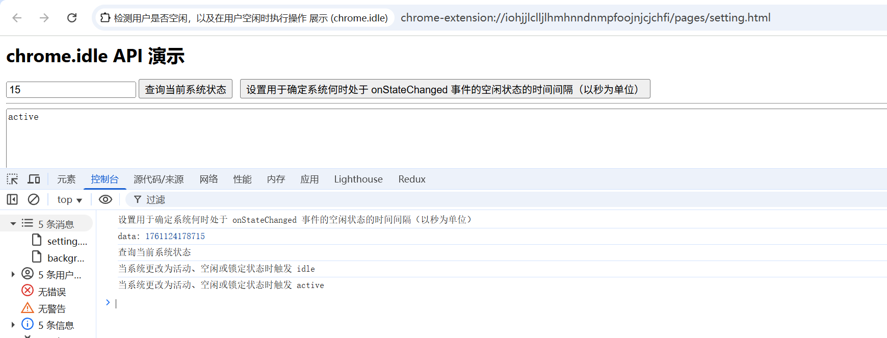

# chrome.idle 检测用户是否空闲，以及在用户空闲时执行操作

> 使用 `chrome.idle` API 检测用户是否处于空闲状态（一段时间没有键盘 / 鼠标输入），以及在用户空闲、锁定屏幕或恢复活动时执行操作。
> 该 API 需要 `idle` 权限。

## manifest.json 配置

```json
{
    "manifest_version": 3,
    "name": "检测用户是否空闲，以及在用户空闲时执行操作 展示 (chrome.idle)",
    "permissions": [
        "idle"
    ],
    "background": {
        "service_worker": "js/background.js"
    }
}
```

## IdleState

```
active    用户正在活跃（默认在 60 秒内有输入）
idle      用户处于空闲状态
locked    屏幕已锁定（Chrome 108+）
```

## 方法

### queryState()
> 查询当前的空闲状态
```javascript
// detectionIntervalInSeconds: 判定为空闲的秒数，必须 >= 15
chrome.idle.queryState(60, (state) => {
    console.log("当前状态:", state); // active | idle | locked
});
```

### setDetectionInterval()
> 设置判定为空闲的间隔（秒），范围 15 ~ ？（默认 60）
```javascript
chrome.idle.setDetectionInterval(120); // 2 分钟无操作视为空闲
```

## 事件

### onStateChanged
> 空闲状态变化时触发
```javascript
chrome.idle.onStateChanged.addListener((newState) => {
    console.log("状态变化:", newState);
    switch (newState) {
        case "active":
            console.log("用户恢复活动");
            break;
        case "idle":
            console.log("用户进入空闲");
            break;
        case "locked":
            console.log("屏幕已锁定");
            break;
    }
});
```

## 使用示例：空闲时暂停任务

```javascript
// 设置空闲阈值为 5 分钟
chrome.idle.setDetectionInterval(5 * 60);

chrome.idle.onStateChanged.addListener((state) => {
    if (state === "idle" || state === "locked") {
        pauseBackgroundWork();
    } else if (state === "active") {
        resumeBackgroundWork();
    }
});

// 启动前查询一次
chrome.idle.queryState(5 * 60, (state) => {
    if (state === "active") {
        resumeBackgroundWork();
    }
});
```

## 说明

- `queryState()` 的间隔参数最小值为 15 秒。
- `locked` 状态（屏幕锁定）在 Chrome 108+ 支持。
- 该 API 通常在 Service Worker 中用于节省资源。

## 项目
> https://github.com/freewu/plugin-demo/blob/main/chrome-extension-demo/demo38/


## 资料
```
https://developer.chrome.com/docs/extensions/reference/api/idle?hl=zh-cn
https://github.com/GoogleChrome/chrome-extensions-samples/tree/main/api-samples/idle
```
