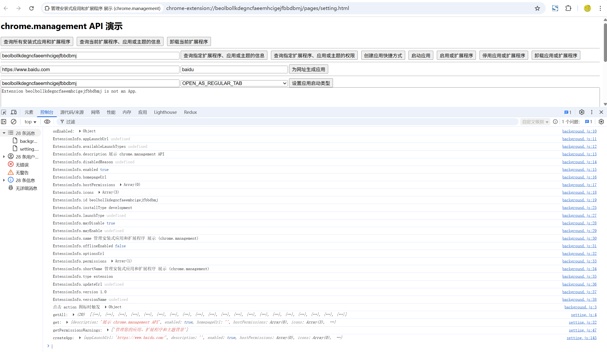

# chrome.management 管理安装式应用和扩展程序

> 使用 `chrome.management` API 管理已安装的应用和扩展程序：查询列表、获取详情、启用 / 禁用、卸载、安装事件监听等。
> 该 API 需要 `management` 权限。多数操作会受用户确认保护。

## manifest.json 配置

```json
{
    "manifest_version": 3,
    "name": "管理安装式应用和扩展程序 展示 (chrome.management)",
    "permissions": [
        "management"
    ],
    "background": {
        "service_worker": "js/background.js"
    }
}
```

## ExtensionInfo 对象

```javascript
{
    id: "abcdef...",            // 扩展程序 ID
    name: "扩展名称",
    shortName: "短名称",
    description: "描述",
    version: "1.0.0",
    enabled: true,              // 是否已启用
    disabledReason: "unknown",  // 禁用原因（permissions_increase | unknown）
    mayDisable: true,           // 当前扩展程序是否可以禁用它
    type: "extension",          // extension | hosted_app | packaged_app | theme | ...
    installType: "normal",      // admin | development | normal | sideload | other
    homepageUrl: "...",
    icons: [ { size: 48, url: "..." } ],
    permissions: ["tabs", "storage"],
    hostPermissions: ["https://*/*"],
    updateUrl: "...",
    offlineEnabled: true
}
```

## 方法

### getAll()
> 获取所有已安装的应用和扩展程序
```javascript
const all = await chrome.management.getAll();
for (const item of all) {
    console.log(item.id, item.name, item.type, item.enabled);
}

// 只获取扩展程序
const extensions = (await chrome.management.getAll()).filter(
    (item) => item.type === "extension"
);
```

### get()
> 获取指定扩展程序的详情
```javascript
const info = await chrome.management.get("扩展程序ID");
console.log(info.name, info.version, info.enabled);
```

### getSelf()
> 获取当前扩展程序自身的详情
```javascript
const self = await chrome.management.getSelf();
console.log("自身:", self.id, self.version);
```

### setEnabled()
> 启用 / 禁用扩展程序
```javascript
await chrome.management.setEnabled("扩展程序ID", false).then(() => {
    console.log("已禁用");
}).catch((error) => {
    console.error("操作失败:", error);
});
```

### uninstall()
> 卸载扩展程序
```javascript
await chrome.management.uninstall("扩展程序ID", {
    showConfirmDialog: true // 是否显示确认对话框，默认 true
});
```

### uninstallSelf()
> 卸载当前扩展程序
```javascript
await chrome.management.uninstallSelf({
    showConfirmDialog: true,
    dialogMessage: "确定要卸载吗？"
});
```

### launchApp()
> 启动应用
```javascript
await chrome.management.launchApp("应用ID");
```

### getPermissionWarningsById() / getPermissionWarningsByManifest()
> 获取权限警告信息
```javascript
const warnings = await chrome.management.getPermissionWarningsById("扩展程序ID");
console.log(warnings);

const manifestWarnings = await chrome.management.getPermissionWarningsByManifest(
    JSON.stringify({ permissions: ["tabs"], host_permissions: ["<all_urls>"] })
);
```

### getIcon()
> 获取扩展程序图标
```javascript
const iconUrl = await chrome.management.getIcon("扩展程序ID", { size: 48 });
console.log(iconUrl);
```

## 事件

### onInstalled
> 有新扩展程序安装时触发
```javascript
chrome.management.onInstalled.addListener((info) => {
    console.log("新安装:", info.name);
});
```

### onUninstalled
> 有扩展程序卸载时触发
```javascript
chrome.management.onUninstalled.addListener((id) => {
    console.log("已卸载:", id);
});
```

### onEnabled / onDisabled
> 扩展程序被启用 / 禁用时触发
```javascript
chrome.management.onEnabled.addListener((info) => {
    console.log("已启用:", info.name);
});
chrome.management.onDisabled.addListener((info) => {
    console.log("已禁用:", info.name);
});
```

## 项目
> https://github.com/freewu/plugin-demo/blob/main/chrome-extension-demo/demo39/


## 资料
```
https://developer.chrome.com/docs/extensions/reference/api/management?hl=zh-cn
https://github.com/GoogleChrome/chrome-extensions-samples/tree/main/api-samples/management
```
