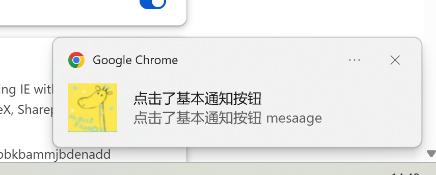
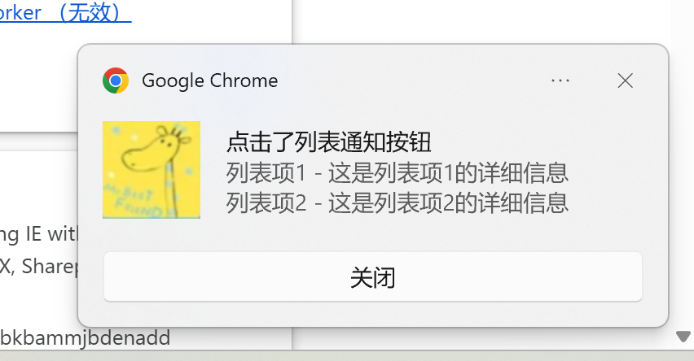
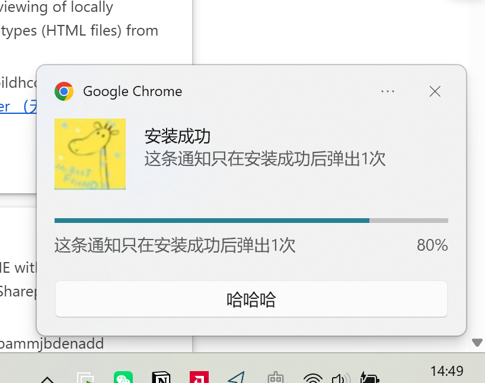

# chrome.notifications 展示通知功能展示

> 使用 `chrome.notifications` API 在系统中创建和展示富文本通知。
> 支持基本、图片、列表、进度四种类型，可包含按钮、图标、进度条等。
> 该 API 需要 `notifications` 权限。从 Chrome 59 起，在大多数平台上通知会由 Chrome 自己的通知中心管理。

## manifest.json 配置

```json
{
    "manifest_version": 3,
    "name": "通知 展示 (chrome.notifications)",
    "permissions": [
        "notifications"
    ],
    "background": {
        "service_worker": "js/background.js"
    }
}
```

## 通知类型

| 类型 | 说明 | 特有字段 |
| ---- | ---- | -------- |
| `basic` | 基本通知 | `iconUrl`、`title`、`message` |
| `image` | 图片通知 | 额外 `imageUrl` |
| `list` | 列表通知 | 额外 `items: [{ title, message }]` |
| `progress` | 进度通知 | 额外 `progress: 0~100` |

## 方法

### create()
> 创建并显示通知，返回通知 ID
```javascript
const notificationId = "demo-notification";

chrome.notifications.create(notificationId, {
    type: "basic",
    iconUrl: "images/icon.png",
    title: "通知标题",
    message: "这是一条通知内容",
    contextMessage: "附加说明",
    priority: 1,                 // -2 ~ 2
    buttons: [
        { title: "按钮一" },
        { title: "按钮二" }
    ],
    requireInteraction: true,    // 是否保持显示直到用户关闭
    silent: false,               // 是否静音
    eventTime: Date.now()
}, (id) => {
    if (chrome.runtime.lastError) {
        console.error("创建通知失败:", chrome.runtime.lastError.message);
    } else {
        console.log("通知已创建:", id);
    }
});
```

```javascript
// 图片类型
chrome.notifications.create("image-notification", {
    type: "image",
    iconUrl: "images/icon.png",
    title: "图片通知",
    message: "带图片的通知",
    imageUrl: "images/banner.png"
});

// 列表类型
chrome.notifications.create("list-notification", {
    type: "list",
    iconUrl: "images/icon.png",
    title: "列表通知",
    message: "多项内容",
    items: [
        { title: "第一项", message: "描述一" },
        { title: "第二项", message: "描述二" }
    ]
});

// 进度类型
chrome.notifications.create("progress-notification", {
    type: "progress",
    iconUrl: "images/icon.png",
    title: "下载中",
    message: "正在下载文件",
    progress: 50 // 0 ~ 100，-1 表示不确定进度
});
```

### update()
> 更新已有通知
```javascript
chrome.notifications.update("progress-notification", {
    progress: 80,
    message: "即将完成"
});
```

### clear()
> 清除指定通知
```javascript
chrome.notifications.clear("demo-notification", (wasCleared) => {
    console.log("是否已清除:", wasCleared);
});
```

### getAll()
> 获取所有活动通知
```javascript
chrome.notifications.getAll((notifications) => {
    console.log("活动通知:", notifications); // { id: true, ... }
});
```

## 事件

### onClicked
> 用户点击通知时触发
```javascript
chrome.notifications.onClicked.addListener((notificationId) => {
    console.log("点击了通知:", notificationId);
    chrome.notifications.clear(notificationId);
});
```

### onClosed
> 通知关闭时触发
```javascript
chrome.notifications.onClosed.addListener((notificationId, byUser) => {
    console.log("通知关闭:", notificationId, "是否用户关闭:", byUser);
});
```

### onButtonClicked
> 用户点击通知按钮时触发
```javascript
chrome.notifications.onButtonClicked.addListener((notificationId, buttonIndex) => {
    console.log("点击按钮:", notificationId, buttonIndex);
});
```

### onPermissionLevelChanged
> 通知权限级别变化时触发
```javascript
chrome.notifications.onPermissionLevelChanged.addListener((level) => {
    console.log("权限级别:", level);
});
```

### onShowSettings
> 用户点击通知设置时触发
```javascript
chrome.notifications.onShowSettings.addListener(() => {
    console.log("用户点击了设置");
});
```

## 项目
> https://github.com/freewu/plugin-demo/blob/main/chrome-extension-demo/demo7/




## 资料
```
https://developer.chrome.com/docs/extensions/reference/api/notifications?hl=zh-cn
https://github.com/GoogleChrome/chrome-extensions-samples/tree/main/api-samples/notifications
```
