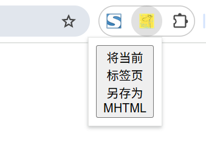

# chrome.offscreen 创建和管理屏幕外文档

> 使用 `chrome.offscreen` API 创建和管理 **屏幕外文档（offscreen document）**。
> Service Worker 中无法使用 DOM API，且很多 Web API（如 `navigator.clipboard`、`localStorage`、`getUserMedia`、`Audio`、`URL.createObjectURL` 等）也不可用。
> offscreen 文档提供了一棵隐藏的 DOM，用于承载这些只能在文档环境使用的 API。
> 一个扩展程序在任一时刻只能有一个 offscreen 文档。该 API 需要 `offscreen` 权限。

## manifest.json 配置

```json
{
    "manifest_version": 3,
    "name": "创建和管理屏幕外文档 展示 (chrome.offscreen)",
    "permissions": [
        "offscreen"
    ],
    "action": {
        "default_popup": "pages/action.html",
        "default_icon": "images/icon.png"
    }
}
```

## 方法

### createDocument()
> 创建 offscreen 文档。如果已存在，则 Promise 会拒绝
```javascript
await chrome.offscreen.createDocument({
    url: "pages/offscreen.html",   // offscreen 文档的相对 URL
    reasons: ["CLIPBOARD"],        // 创建原因，见下表
    justification: "需要在屏幕外文档中操作剪贴板" // 说明用途，会展示给用户
}).catch((error) => {
    console.error("创建失败:", error);
});
```

### hasDocument()
> 判断扩展程序当前是否存在 offscreen 文档
```javascript
const hasDoc = await chrome.offscreen.hasDocument();
console.log("是否存在 offscreen 文档:", hasDoc);
```

### closeDocument()
> 关闭 offscreen 文档
```javascript
await chrome.offscreen.closeDocument();
console.log("offscreen 文档已关闭");
```

## Reason（创建原因）

`reasons` 只能从以下枚举中选取：

```
TESTING
AUDIO_PLAYBACK
IFRAME_SCRIPTING
DOM_SCRAPING
BLOBS
DOM_PARSER
USER_MEDIA
DISPLAY_MEDIA
WEB_RTC
CLIPBOARD
LOCAL_STORAGE
WORKERS
BATTERY_STATUS
MATCH_MEDIA
GEOLOCATION
```

## offscreen 文档示例

`pages/offscreen.html`
```html
<!DOCTYPE html>
<html>
<head><meta charset="utf-8"></head>
<body>
    <script src="offscreen.js"></script>
</body>
</html>
```

`js/offscreen.js`
```javascript
// 在 offscreen 文档中可以访问完整 DOM 与 Web API
chrome.runtime.onMessage.addListener((message, sender, sendResponse) => {
    if (message.type === "copy") {
        navigator.clipboard.writeText(message.text).then(() => {
            sendResponse({ ok: true });
        });
        return true; // 异步响应
    }
});
```

## 与 Service Worker 通信

```javascript
// background.js 中调用 offscreen 文档
async function copyText(text) {
    if (!(await chrome.offscreen.hasDocument())) {
        await chrome.offscreen.createDocument({
            url: "pages/offscreen.html",
            reasons: ["CLIPBOARD"],
            justification: "复制文本到剪贴板"
        });
    }
    const response = await chrome.runtime.sendMessage({ type: "copy", text });
    console.log("复制结果:", response);
}
```

## 说明

- offscreen 文档没有可见界面，用户看不到它。
- 每个扩展程序同时只能存在一个 offscreen 文档，重复创建会报错。
- 该 API 没有事件。

## 项目
> https://github.com/freewu/plugin-demo/blob/main/chrome-extension-demo/demo25/


## 资料
```
https://developer.chrome.com/docs/extensions/reference/api/offscreen?hl=zh-cn
https://github.com/GoogleChrome/chrome-extensions-samples/tree/main/functional-samples/sample.offscreen-clipboard
```
