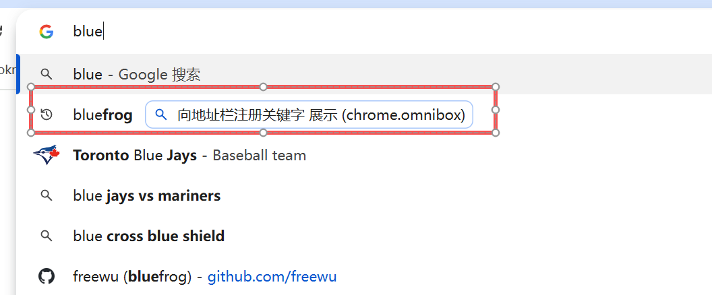
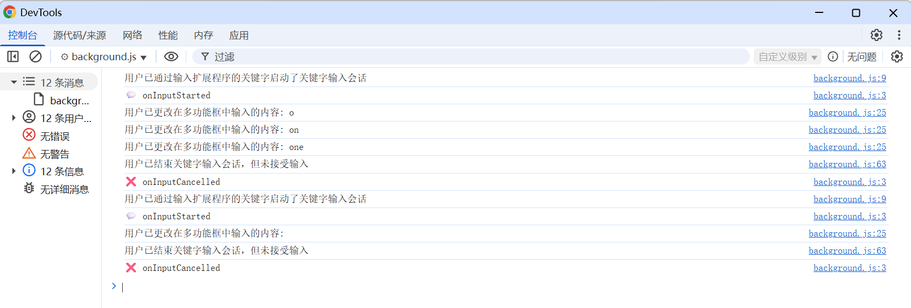

# chrome.omnibox 向 Google Chrome 的地址栏注册关键字

> 使用 `chrome.omnibox` API 向 Chrome 的地址栏（omnibox）注册一个关键字。
> 用户在地址栏输入该关键字并按下空格 / Tab 后，即可进入该扩展程序的「关键词模式」，输入内容时会实时收到事件，从而提供搜索建议或执行搜索。
> 该 API 需要 `omnibox` 权限（Manifest V2 中关键字监听不再需要额外权限，但建议在 manifest 中声明 `omnibox`）。

## manifest.json 配置

```json
{
    "manifest_version": 3,
    "name": "向地址栏注册关键字 展示 (chrome.omnibox)",
    "omnibox": { "keyword": "bluefrog" },
    "permissions": [
        "omnibox",
        "tabs"
    ],
    "background": {
        "service_worker": "js/background.js"
    }
}
```

> 上面的配置表示：在地址栏输入 `bluefrog` 再按空格，就会进入该扩展程序的关键词模式。

## 方法

### setDefaultSuggestion()
> 设置默认的提示建议，用户一进入关键词模式就会看到
```javascript
chrome.omnibox.setDefaultSuggestion({
    description: "在 bluefrog 中搜索：%s" // %s 会被用户输入的内容替换
});
```

### suggest()
> 返回自定义的搜索建议列表（最多 6 条，不含默认建议）
```javascript
chrome.omnibox.onInputChanged.addListener((text, suggest) => {
    const suggestions = [
        {
            content: text + " chrome",
            description: "搜索 <match>" + text + " chrome</match>"
        },
        {
            content: text + " extension",
            description: "搜索 <match>" + text + " extension</match>"
        }
    ];
    suggest(suggestions);
});
```

## 事件

### onInputStarted
> 用户进入关键词模式时触发（输入关键字并按下空格后）
```javascript
chrome.omnibox.onInputStarted.addListener(() => {
    console.log("进入关键词模式");
    chrome.omnibox.setDefaultSuggestion({
        description: "输入内容进行搜索"
    });
});
```

### onInputChanged
> 用户输入内容变化时触发，可用于返回搜索建议
```javascript
chrome.omnibox.onInputChanged.addListener((text, suggest) => {
    console.log("当前输入:", text);
    suggest([
        { content: text, description: "搜索 " + text }
    ]);
});
```

### onInputEntered
> 用户按下回车确认时触发，通常在此打开搜索结果页
```javascript
chrome.omnibox.onInputEntered.addListener((text, disposition) => {
    console.log("确认输入:", text);
    console.log("打开方式:", disposition); // currentTab | newForegroundTab | newBackgroundTab

    const url = "https://www.google.com/search?q=" + encodeURIComponent(text);
    switch (disposition) {
        case "currentTab":
            chrome.tabs.update({ url });
            break;
        case "newForegroundTab":
            chrome.tabs.create({ url });
            break;
        case "newBackgroundTab":
            chrome.tabs.create({ url, active: false });
            break;
    }
});
```

### onInputCancelled
> 用户取消关键词模式（如按 Esc）时触发
```javascript
chrome.omnibox.onInputCancelled.addListener(() => {
    console.log("已取消关键词模式");
});
```

### onDeleteSuggestion
> 用户删除了某条建议时触发
```javascript
chrome.omnibox.onDeleteSuggestion.addListener((text) => {
    console.log("删除了建议:", text);
});
```

## 项目
> https://github.com/freewu/plugin-demo/blob/main/chrome-extension-demo/demo26/



## 资料
```
https://developer.chrome.com/docs/extensions/reference/api/omnibox?hl=zh-cn
https://github.com/GoogleChrome/chrome-extensions-samples/tree/main/api-samples/omnibox
```
