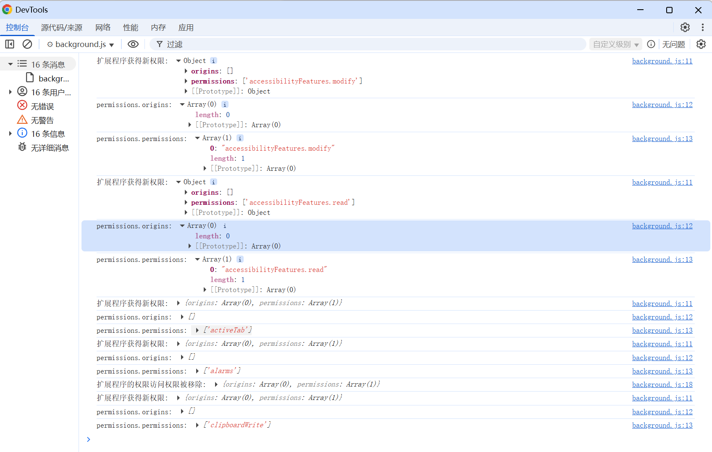

# chrome.permissions 可选的权限

> 使用 `chrome.permissions` API 在运行时请求可选权限，而不是在安装时一次性申请所有权限。
> 通过把敏感权限声明为 `optional_permissions` / `optional_host_permissions`，扩展程序可以在需要时再向用户请求，降低安装门槛。
> 该 API 无需单独权限声明。

## manifest.json 配置

```json
{
    "manifest_version": 3,
    "name": "可选权限管理 展示 (chrome.permissions)",
    "optional_permissions": [
        "tabs",
        "bookmarks",
        "history",
        "downloads",
        "cookies",
        "management",
        "notifications"
    ],
    "optional_host_permissions": [
        "*://*/*"
    ]
}
```

> 注意：并非所有权限都可以作为可选权限，例如 `activeTab`、`storage`、`scripting` 等本身不敏感，无需请求；而被禁止的权限无法通过 `optional_permissions` 请求。

## Permissions 对象

```javascript
{
    permissions: ["tabs", "bookmarks"],   // API 权限
    origins: ["https://*.example.com/*"]  // 主机权限
}
```

## 方法

### contains()
> 检查是否已获得某些权限
```javascript
const hasPermission = await chrome.permissions.contains({
    permissions: ["tabs"],
    origins: ["https://*.example.com/*"]
});
console.log("是否已获得权限:", hasPermission);
```

### request()
> 请求权限，必须在用户手势（如点击按钮）中调用
```javascript
document.getElementById("request-btn").addEventListener("click", async () => {
    try {
        const granted = await chrome.permissions.request({
            permissions: ["bookmarks"],
            origins: ["https://*.example.com/*"]
        });
        if (granted) {
            console.log("用户授予了权限");
        } else {
            console.log("用户拒绝了权限");
        }
    } catch (error) {
        console.error("请求失败:", error);
    }
});
```

### remove()
> 移除已授予的权限
```javascript
const removed = await chrome.permissions.remove({
    permissions: ["bookmarks"]
});
console.log("是否已移除:", removed);
```

### getAll()
> 获取当前扩展程序拥有的所有权限
```javascript
const all = await chrome.permissions.getAll();
console.log("API 权限:", all.permissions);
console.log("主机权限:", all.origins);
```

## 事件

### onAdded
> 新增权限时触发
```javascript
chrome.permissions.onAdded.addListener((permissions) => {
    console.log("新增权限:", permissions.permissions);
    console.log("新增主机权限:", permissions.origins);
});
```

### onRemoved
> 移除权限时触发
```javascript
chrome.permissions.onRemoved.addListener((permissions) => {
    console.log("移除权限:", permissions.permissions);
    console.log("移除主机权限:", permissions.origins);
});
```

## 使用示例：按需请求历史记录权限

```javascript
async function ensureHistoryPermission() {
    const has = await chrome.permissions.contains({ permissions: ["history"] });
    if (has) return true;
    return await chrome.permissions.request({ permissions: ["history"] });
}

document.getElementById("load-history").addEventListener("click", async () => {
    if (await ensureHistoryPermission()) {
        const items = await chrome.history.search({ text: "", maxResults: 10 });
        console.log(items);
    }
});
```

## 项目
> https://github.com/freewu/plugin-demo/blob/main/chrome-extension-demo/demo31/


## 资料
```
https://developer.chrome.com/docs/extensions/reference/api/permissions?hl=zh-cn
https://developer.chrome.com/docs/extensions/develop/concepts/declare-permissions?hl=zh-cn
```
