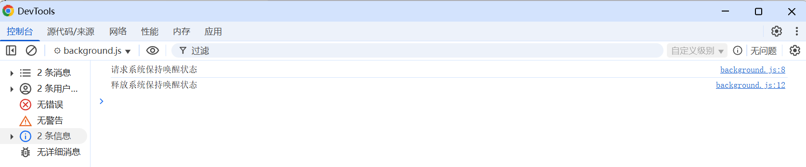

# chrome.power 电源管理

> 使用 `chrome.power` API 让系统保持唤醒状态，防止在扩展程序执行任务时进入休眠。
> 该 API 需要 `power` 权限。注意：`requestKeepAwake()` 会显著消耗电量，请在任务完成后调用 `releaseKeepAwake()` 释放。

## manifest.json 配置

```json
{
    "manifest_version": 3,
    "name": "电源管理 展示 (chrome.power)",
    "permissions": [
        "power"
    ],
    "background": {
        "service_worker": "js/background.js"
    }
}
```

## Level（保持唤醒级别）

```
system   仅防止系统进入休眠（允许屏幕关闭）
display  防止屏幕关闭和系统休眠
```

> `screen` 级别已废弃，等同于 `display`。

## 方法

### requestKeepAwake()
> 请求让系统保持唤醒
```javascript
chrome.power.requestKeepAwake(
    "display" // system | display
);
console.log("已请求保持屏幕唤醒");
```

### releaseKeepAwake()
> 释放保持唤醒状态
```javascript
chrome.power.releaseKeepAwake();
console.log("已释放保持唤醒");
```

## 使用示例

```javascript
// 开始一个长时间任务时保持唤醒
async function startLongTask() {
    chrome.power.requestKeepAwake("system");
    try {
        await doSomethingLong();
    } finally {
        // 无论成功失败都释放
        chrome.power.releaseKeepAwake();
    }
}
```

## 说明

- 与 `chrome.alarms` 不同，电源管理不会“唤醒”已休眠的设备，它只是阻止设备进入休眠。
- 多个扩展程序可以同时请求保持唤醒，只要有一个扩展程序保持请求，系统就不会休眠。
- 该 API 没有事件。

## 项目
> https://github.com/freewu/plugin-demo/blob/main/chrome-extension-demo/demo12/


## 资料
```
https://developer.chrome.com/docs/extensions/reference/api/power?hl=zh-cn
https://github.com/GoogleChrome/chrome-extensions-samples/tree/main/api-samples/power
```
