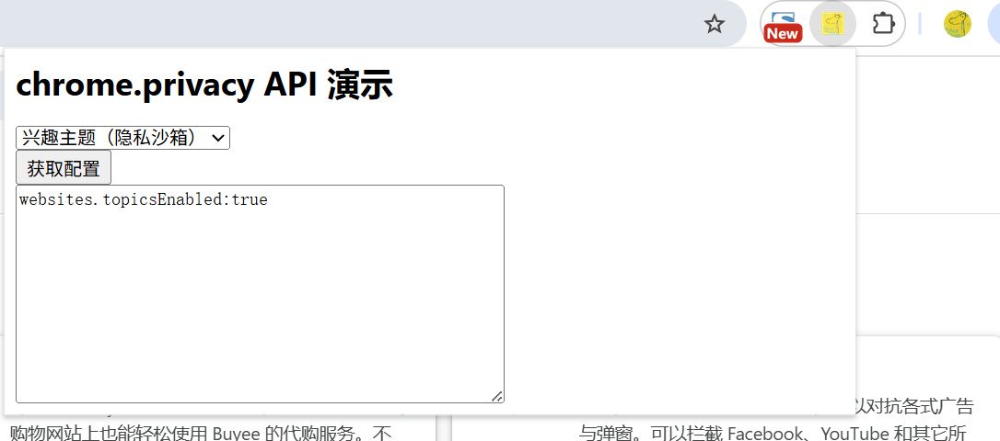

# chrome.privacy 控制 Chrome 中可能会影响用户隐私的功能的使用情况

> 使用 `chrome.privacy` API 控制 Chrome 中可能会影响用户隐私的功能的使用情况，例如是否允许第三方 Cookie、是否启用安全浏览、是否发送「不跟踪」请求等。
> 这些设置实际上对应 Chrome 设置页中的隐私选项，扩展程序可以读取和修改它们。
> 该 API 需要 `privacy` 权限。所有子设置都是 `ChromeSetting` 类型，提供统一的 `get()` / `set()` / `clear()` 和 `onChange` 事件。

## manifest.json 配置

```json
{
    "manifest_version": 3,
    "name": "用户隐私管理 展示 (chrome.privacy)",
    "permissions": [
        "privacy"
    ],
    "background": {
        "service_worker": "js/background.js"
    }
}
```

## 隐私设置分类

`chrome.privacy` 下分为三大类：

### network（网络）
```
networkPredictionEnabled        是否预解析 / 预连接网络地址
webRTCIPHandlingPolicy          调用 WebRTC 时使用的 IP 处理政策
```

### services（服务）
```
alternateErrorPagesEnabled      是否显示建议的替代错误页面
autofillAddressEnabled          是否启用地址自动填充
autofillCreditCardEnabled       是否启用信用卡自动填充
autofillEnabled                 是否启用表单自动填充（聚合）
passwordSavingEnabled           是否允许保存密码
safeBrowsingEnabled             是否启用安全浏览
safeBrowsingExtendedReportingEnabled  是否发送扩展报告
searchSuggestEnabled            是否启用搜索建议
spellingServiceEnabled          是否使用拼写检查服务
translationServiceEnabled       是否启用翻译服务
```

### websites（网站）
```
hyperlinkAuditingEnabled        是否发送 hyperlink auditing ping
referrersEnabled                是否发送 Referer 头
thirdPartyCookiesAllowed        是否允许第三方 Cookie
protectedContentEnabled         是否允许受保护内容（部分平台）
```

## ChromeSetting 通用方法

### get()
> 读取当前设置
```javascript
chrome.privacy.websites.thirdPartyCookiesAllowed.get(
    { incognito: false }, // details
    (details) => {
        console.log("当前值:", details.value);       // 设置值
        console.log("可被扩展程序控制:", details.levelOfControl); // not_controllable | controlled_by_other_extensions | controllable_by_this_extension | controlled_by_this_extension
    }
);
```

### set()
> 修改当前设置
```javascript
chrome.privacy.websites.thirdPartyCookiesAllowed.set(
    {
        value: false,        // 要设置的值
        scope: "regular"     // regular | regular_only | incognito_persistent | incognito_session_only
    },
    () => {
        if (chrome.runtime.lastError) {
            console.error("设置失败:", chrome.runtime.lastError.message);
        } else {
            console.log("第三方 Cookie 已禁用");
        }
    }
);
```

### clear()
> 清除设置，恢复为默认值
```javascript
chrome.privacy.websites.thirdPartyCookiesAllowed.clear(
    { scope: "regular" },
    () => {
        console.log("已恢复默认值");
    }
);
```

### ChromeSetting 的 onChange
> 设置变化时触发
```javascript
chrome.privacy.websites.thirdPartyCookiesAllowed.onChange.addListener((details) => {
    console.log("设置变化:", details.value);
    console.log("控制级别:", details.levelOfControl);
});
```

## 综合示例

```javascript
// 检查扩展程序是否可以控制某项设置
chrome.privacy.services.safeBrowsingEnabled.get({}, (details) => {
    if (details.levelOfControl === "controllable_by_this_extension") {
        chrome.privacy.services.safeBrowsingEnabled.set({ value: true });
    }
});
```

## 项目
> https://github.com/freewu/plugin-demo/blob/main/chrome-extension-demo/demo27/


## 资料
```
https://developer.chrome.com/docs/extensions/reference/api/privacy?hl=zh-cn
https://developer.chrome.com/docs/extensions/reference/api/types?hl=zh-cn#type-ChromeSetting
```
