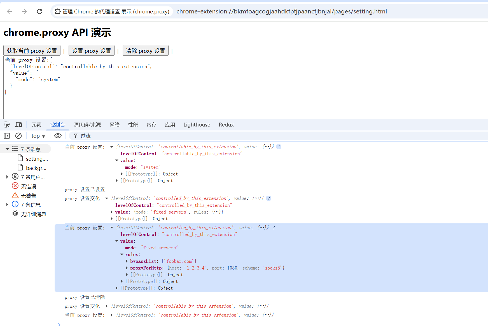

# chrome.proxy 管理 Chrome 的代理设置

> 使用 `chrome.proxy` API 管理 Chrome 的代理设置。扩展程序可以配置直接连接、自动检测、PAC 脚本、固定服务器等代理模式，也可以监听代理错误。
> 该 API 需要 `proxy` 权限，修改代理设置通常会触发浏览器提示。

## manifest.json 配置

```json
{
    "manifest_version": 3,
    "name": "管理 Chrome 的代理设置 展示 (chrome.proxy)",
    "permissions": [
        "proxy"
    ],
    "background": {
        "service_worker": "js/background.js"
    }
}
```

## ProxyConfig

```javascript
{
    mode: "fixed_servers",  // direct | auto_detect | pac_script | fixed_servers | system
    rules: {                // mode 为 fixed_servers 时使用
        singleProxy: {
            scheme: "http",  // http | https | socks4 | socks5
            host: "127.0.0.1",
            port: 8080
        },
        bypassList: ["<local>", "*.example.com"] // 不使用代理的地址
    },
    pacScript: {            // mode 为 pac_script 时使用
        url: "https://example.com/proxy.pac",
        // data: "function FindProxyForURL(url, host) { ... }", // 内联 PAC 脚本
        // mandatory: false
    }
}
```

## 方法

### settings.get()
> 获取当前代理设置
```javascript
chrome.proxy.settings.get(
    { incognito: false },
    (details) => {
        console.log("当前代理配置:", details.value);   // ProxyConfig
        console.log("控制级别:", details.levelOfControl);
    }
);
```

### settings.set()
> 设置代理
```javascript
// 固定服务器模式
chrome.proxy.settings.set({
    value: {
        mode: "fixed_servers",
        rules: {
            singleProxy: { scheme: "http", host: "127.0.0.1", port: 8080 },
            bypassList: ["<local>"]
        }
    },
    scope: "regular" // regular | regular_only | incognito_persistent | incognito_session_only
}, () => {
    if (chrome.runtime.lastError) {
        console.error("设置代理失败:", chrome.runtime.lastError.message);
    } else {
        console.log("代理已设置");
    }
});
```

```javascript
// 直接连接（不使用代理）
chrome.proxy.settings.set({
    value: { mode: "direct" },
    scope: "regular"
});
```

```javascript
// PAC 脚本模式
chrome.proxy.settings.set({
    value: {
        mode: "pac_script",
        pacScript: {
            data: "function FindProxyForURL(url, host) { return 'PROXY 127.0.0.1:8080; DIRECT'; }"
        }
    },
    scope: "regular"
});
```

### settings.clear()
> 清除代理设置，恢复为系统默认
```javascript
chrome.proxy.settings.clear({ scope: "regular" }, () => {
    console.log("代理设置已清除");
});
```

## 事件

### settings.onChange
> 代理设置变化时触发
```javascript
chrome.proxy.settings.onChange.addListener((details) => {
    console.log("代理设置变化:", details);
    console.log("新的配置:", details.value);
});
```

### onProxyError
> 代理请求出错时触发（例如无法连接到代理服务器）
```javascript
chrome.proxy.onProxyError.addListener((details) => {
    console.error("代理错误:", details.error);   // 错误信息
    console.error("详细信息:", details.details);
    console.error("发生错误的地址:", details.fatal);
});
```

## 项目
> https://github.com/freewu/plugin-demo/blob/main/chrome-extension-demo/demo43/


## 资料
```
https://developer.chrome.com/docs/extensions/reference/api/proxy?hl=zh-cn
https://github.com/GoogleChrome/chrome-extensions-samples/tree/main/api-samples/proxy
```
