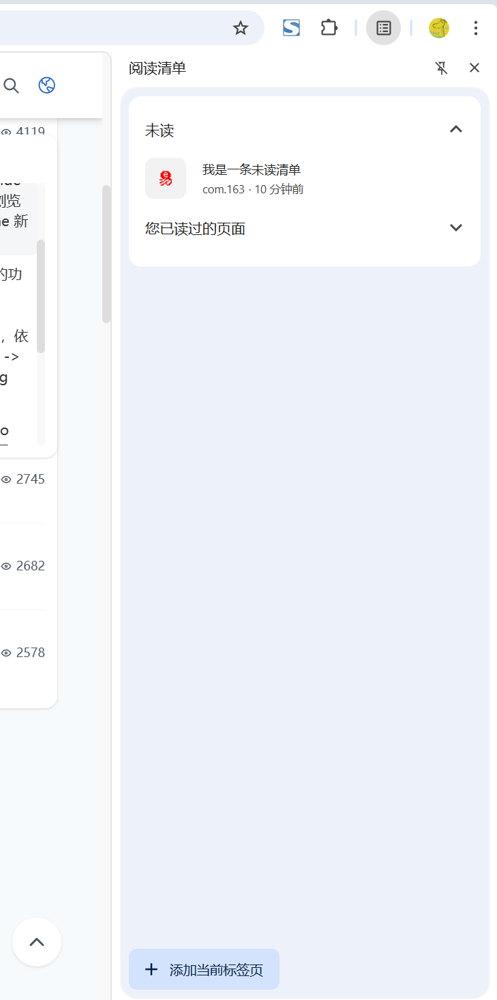

# chrome.readingList 读取和修改阅读清单中的内容

> 使用 `chrome.readingList` API 读取和修改 Chrome 阅读清单（Reading List）中的内容。
> 阅读清单是 Chrome 自带的「稍后阅读」功能，用户可以把网页保存到侧边栏的阅读清单中。
> 该 API 需要 `readingList` 权限。

## manifest.json 配置

```json
{
    "manifest_version": 3,
    "name": "阅读清单 展示 (chrome.readingList)",
    "permissions": [
        "readingList"
    ],
    "background": {
        "service_worker": "js/background.js"
    }
}
```

## ReadingListEntry

```javascript
{
    url: "https://example.com",  // 条目网址
    title: "示例页面",            // 标题
    hasBeenRead: false,          // 是否已读
    creationTime: 1759218545.123,// 创建时间（自 epoch 起的毫秒数）
    // lastUpdateTime: ...,      // 上次更新时间
}
```

## 方法

### addEntry()
> 向阅读清单添加一个条目
```javascript
chrome.readingList.addEntry({
    url: "https://www.example.com/article",
    title: "一篇好文章",
    hasBeenRead: false
}).then(() => {
    console.log("已添加到阅读清单");
}).catch((error) => {
    console.error("添加失败:", error);
});
```

### removeEntry()
> 从阅读清单删除一个条目
```javascript
chrome.readingList.removeEntry({
    url: "https://www.example.com/article"
}).then(() => {
    console.log("已从阅读清单删除");
});
```

### updateEntry()
> 更新条目（如标题、已读状态）
```javascript
chrome.readingList.updateEntry({
    url: "https://www.example.com/article",
    title: "新的标题",
    hasBeenRead: true
}).then(() => {
    console.log("已更新");
});
```

### query()
> 查询阅读清单条目
```javascript
const entries = await chrome.readingList.query({
    url: "https://www.example.com/article", // 可选，按 URL 过滤
    hasBeenRead: false,                      // 可选，按已读状态过滤
    title: "标题关键字"                       // 可选，按标题以不区分大小写的方式匹配
});
for (const entry of entries) {
    console.log(entry.url, entry.title, entry.hasBeenRead, entry.creationTime);
}
```

## 事件

### onEntryAdded
> 新增条目时触发
```javascript
chrome.readingList.onEntryAdded.addListener((entry) => {
    console.log("新增阅读清单条目:", entry.url, entry.title);
});
```

### onEntryRemoved
> 删除条目时触发
```javascript
chrome.readingList.onEntryRemoved.addListener((entry) => {
    console.log("删除阅读清单条目:", entry.url);
});
```

### onEntryUpdated
> 更新条目时触发
```javascript
chrome.readingList.onEntryUpdated.addListener((entry) => {
    console.log("更新阅读清单条目:", entry.url, entry.hasBeenRead);
});
```

## 项目
> https://github.com/freewu/plugin-demo/blob/main/chrome-extension-demo/demo18/


## 资料
```
https://developer.chrome.com/docs/extensions/reference/api/readingList?hl=zh-cn
https://github.com/GoogleChrome/chrome-extensions-samples/tree/main/api-samples/readingList
```
