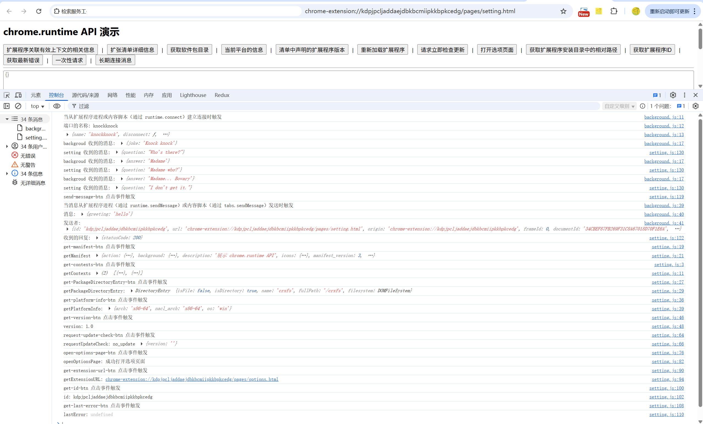

# chrome.runtime 检索服务工作线程、返回清单的相关详细信息，以及监听和响应扩展程序生命周期中的事件

> `chrome.runtime` API 提供扩展程序运行时相关的功能：获取扩展程序 ID、资源 URL、清单信息，发送消息、监听生命周期事件等。
> 它是扩展程序中最基础、最常用的 API，Service Worker、popup、content script 中都可以使用。

## 属性

### id
> 当前扩展程序的 ID
```javascript
console.log("扩展程序 ID:", chrome.runtime.id);
```

### lastError
> 上一次 API 调用产生的错误（仅在回调上下文中有效）
```javascript
chrome.runtime.sendMessage({ hello: "world" }, (response) => {
    if (chrome.runtime.lastError) {
        console.error("消息发送失败:", chrome.runtime.lastError.message);
    } else {
        console.log("响应:", response);
    }
});
```

## 方法

### getURL()
> 将扩展程序内的相对路径转换为完整 URL
```javascript
const url = chrome.runtime.getURL("images/icon.png");
// chrome-extension://<id>/images/icon.png
console.log(url);
```

### getManifest()
> 获取扩展程序的 manifest.json 内容
```javascript
const manifest = chrome.runtime.getManifest();
console.log("名称:", manifest.name);
console.log("版本:", manifest.version);
console.log("权限:", manifest.permissions);
```

### getPlatformInfo()
> 获取操作系统和架构信息
```javascript
const info = await chrome.runtime.getPlatformInfo();
console.log("操作系统:", info.os);       // mac | win | android | cros | linux | openbsd
console.log("架构:", info.arch);         // arm | arm64 | x86-32 | x86-64 | mips ...
```

### sendMessage()
> 向扩展程序的其他上下文（Service Worker、popup、content script）发送消息
```javascript
chrome.runtime.sendMessage(
    { type: "greeting", text: "hello" }, // 消息内容
    (response) => {
        console.log("收到响应:", response);
    }
);
```

```javascript
// Promise 写法（Manifest V3）
const response = await chrome.runtime.sendMessage({ type: "greeting" });
```

### connect()
> 建立长连接
```javascript
const port = chrome.runtime.connect({ name: "demo-port" });
port.postMessage({ hello: "world" });
port.onMessage.addListener((msg) => console.log("收到:", msg));
port.onDisconnect.addListener(() => console.log("连接断开"));
```

### getContexts()
> 获取扩展程序当前活跃的上下文（Chrome 116+）
```javascript
const contexts = await chrome.runtime.getContexts({
    contextTypes: ["POPUP", "OFFSCREEN_DOCUMENT"]
});
console.log("当前上下文:", contexts);
```

### openOptionsPage()
> 打开扩展程序的选项页面
```javascript
chrome.runtime.openOptionsPage();
```

### setUninstallURL()
> 设置扩展程序卸载后跳转的页面（最多 1023 个字符）
```javascript
chrome.runtime.setUninstallURL("https://example.com/uninstalled");
```

### reload()
> 重新加载扩展程序
```javascript
chrome.runtime.reload();
```

## 事件

### onInstalled
> 扩展程序安装、更新或 Chrome 更新时触发
```javascript
chrome.runtime.onInstalled.addListener((details) => {
    console.log("触发原因:", details.reason); // install | update | chrome_update | shared_module_update
    console.log("之前的版本:", details.previousVersion);
});
```

### onStartup
> 浏览器启动时触发
```javascript
chrome.runtime.onStartup.addListener(() => {
    console.log("浏览器已启动");
});
```

### onMessage
> 收到其他上下文消息时触发
```javascript
chrome.runtime.onMessage.addListener((message, sender, sendResponse) => {
    console.log("收到消息:", message);
    console.log("发送者:", sender.id, sender.tab?.url);

    if (message.type === "greeting") {
        sendResponse({ reply: "hello from background" });
    }
    return true; // 返回 true 表示异步调用 sendResponse
});
```

### onConnect
> 有上下文发起长连接时触发
```javascript
chrome.runtime.onConnect.addListener((port) => {
    console.log("有新连接:", port.name);
    port.onMessage.addListener((msg) => {
        console.log("收到:", msg);
        port.postMessage({ reply: "ok" });
    });
});
```

### onSuspend / onSuspendCanceled
> Service Worker 即将被挂起 / 取消挂起时触发
```javascript
chrome.runtime.onSuspend.addListener(() => {
    console.log("Service Worker 即将挂起");
});
chrome.runtime.onSuspendCanceled.addListener(() => {
    console.log("挂起已取消");
});
```

### onMessageExternal / onConnectExternal
> 收到其他扩展程序或网页消息时触发
```javascript
chrome.runtime.onMessageExternal.addListener((message, sender, sendResponse) => {
    console.log("来自外部的消息:", message, sender.id);
    sendResponse({ ok: true });
});
```

## 项目
> https://github.com/freewu/plugin-demo/blob/main/chrome-extension-demo/demo33/


## 资料
```
https://developer.chrome.com/docs/extensions/reference/api/runtime?hl=zh-cn
https://github.com/GoogleChrome/chrome-extensions-samples/tree/main/api-samples/runtime
```
