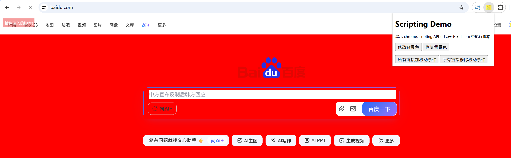

# chrome.scripting 在不同上下文中执行脚本

> 使用 `chrome.scripting` API 在页面中注入 JavaScript、CSS，或注册 / 注销内容脚本。
> 相比 Manifest V2 的 `chrome.tabs.executeScript`，`chrome.scripting` 提供了更强大、更清晰的注入能力。
> 该 API 需要 `scripting` 权限，并且要对目标页面拥有 **主机权限** 或 `activeTab` 权限。

## manifest.json 配置

```json
{
    "manifest_version": 3,
    "name": "在不同上下文中执行脚本 展示 (chrome.scripting)",
    "permissions": [
        "scripting",
        "webNavigation",
        "tabs"
    ],
    "host_permissions": [
        "https://*/*",
        "http://*/*"
    ],
    "background": {
        "service_worker": "js/background.js"
    }
}
```

## 方法

### executeScript()
> 在目标标签页中注入并执行 JavaScript
```javascript
// 注入代码字符串
const results = await chrome.scripting.executeScript({
    target: { tabId: 123 },          // 目标（tabId / frameIds / allFrames）
    func: (name) => {
        console.log("hello", name);
        return document.title;
    },
    args: ["world"],                  // 传给 func 的参数
    world: "ISOLATED"                 // ISOLATED | MAIN
});
console.log("执行结果:", results);
```

```javascript
// 注入文件
await chrome.scripting.executeScript({
    target: { tabId: 123 },
    files: ["js/content-script.js"]
});
```

```javascript
// 注入到所有框架
await chrome.scripting.executeScript({
    target: { tabId: 123, allFrames: true },
    files: ["js/content-script.js"]
});
```

### insertCSS()
> 向目标标签页注入 CSS
```javascript
await chrome.scripting.insertCSS({
    target: { tabId: 123 },
    css: "body { background: red !important; }"
});

// 或注入 CSS 文件
await chrome.scripting.insertCSS({
    target: { tabId: 123 },
    files: ["css/content-style.css"]
});
```

### removeCSS()
> 移除之前注入的 CSS
```javascript
await chrome.scripting.removeCSS({
    target: { tabId: 123 },
    files: ["css/content-style.css"]
});
```

### registerContentScripts()
> 动态注册内容脚本（持久化，可在多个页面自动运行）
```javascript
await chrome.scripting.registerContentScripts([{
    id: "my-script",
    matches: ["https://*.example.com/*"],
    js: ["js/content-script.js"],
    css: ["css/content-style.css"],
    runAt: "document_idle",          // document_start | document_end | document_idle
    world: "ISOLATED",
    persistAcrossSessions: true
}]);
```

### getRegisteredContentScripts()
> 获取已注册的内容脚本
```javascript
const scripts = await chrome.scripting.getRegisteredContentScripts();
console.log(scripts);
```

### updateContentScripts()
> 更新已注册的内容脚本
```javascript
await chrome.scripting.updateContentScripts([{
    id: "my-script",
    matches: ["https://*.example.org/*"]
}]);
```

### unregisterContentScripts()
> 注销内容脚本
```javascript
await chrome.scripting.unregisterContentScripts({ ids: ["my-script"] });
// 注销全部
await chrome.scripting.unregisterContentScripts();
```

## 示例：右键菜单注入脚本

```javascript
chrome.runtime.onInstalled.addListener(() => {
    chrome.contextMenus.create({
        id: "inject",
        title: "注入样式",
        contexts: ["page"]
    });
});

chrome.contextMenus.onClicked.addListener(async (info, tab) => {
    if (info.menuItemId === "inject") {
        await chrome.scripting.insertCSS({
            target: { tabId: tab.id },
            css: "body { background: yellow !important; }"
        });
    }
});
```

## 说明

- `world: "MAIN"` 表示在页面的主世界中执行，可访问页面的 JS 变量；默认 `ISOLATED` 在隔离世界中执行，无法访问页面变量。
- `executeScript()` 的 `func` 会被序列化，不能引用闭包变量，需通过 `args` 传参。
- 动态注册的内容脚本默认在当前会话有效，若需跨会话保留请设置 `persistAcrossSessions: true`。

## 项目
> https://github.com/freewu/plugin-demo/blob/main/chrome-extension-demo/demo17/


## 资料
```
https://developer.chrome.com/docs/extensions/reference/api/scripting?hl=zh-cn
https://github.com/GoogleChrome/chrome-extensions-samples/tree/main/api-samples/scripting
```
