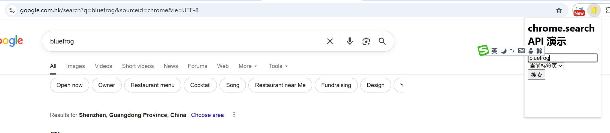

# chrome.search 通过默认提供程序进行搜索

> 使用 `chrome.search` API 通过 Chrome 的默认搜索引擎（或指定提供程序）进行搜索。
> 该 API 需要 `search` 权限。搜索结果通常会在当前标签页或新标签页打开。

## manifest.json 配置

```json
{
    "manifest_version": 3,
    "name": "搜索 展示 (chrome.search)",
    "permissions": [
        "search"
    ],
    "action": {
        "default_popup": "pages/action.html",
        "default_icon": "images/icon.png"
    }
}
```

## 方法

### query()
> 使用默认搜索引擎进行搜索
```javascript
await chrome.search.query({
    text: "chrome extension",              // 搜索关键字
    disposition: "NEW_TAB",                // CURRENT_TAB | NEW_TAB | NEW_WINDOW
    // tabId: 123                          // 当 disposition 为 CURRENT_TAB 时指定标签页
}).then(() => {
    console.log("搜索已执行");
}).catch((error) => {
    console.error("搜索失败:", error);
});
```

### disposition 可选值
```
CURRENT_TAB  在当前标签页中显示搜索结果
NEW_TAB      在新标签页中显示搜索结果（默认）
NEW_WINDOW   在新窗口中显示搜索结果
```

## 使用示例

```javascript
// 在当前标签页中搜索选中的文本
async function searchText(text) {
    await chrome.search.query({
        text: text,
        disposition: "CURRENT_TAB"
    });
}

// 在新标签页中搜索
document.getElementById("search-btn").addEventListener("click", () => {
    const keyword = document.getElementById("keyword-input").value;
    if (keyword) {
        chrome.search.query({ text: keyword, disposition: "NEW_TAB" });
    }
});
```

## 说明

- `chrome.search` 使用的是用户设置的默认搜索引擎（如 Google、Bing），扩展程序无法指定其他搜索引擎。
- `chrome.search` 没有事件。

## 项目
> https://github.com/freewu/plugin-demo/blob/main/chrome-extension-demo/demo13/


## 资料
```
https://developer.chrome.com/docs/extensions/reference/api/search?hl=zh-cn
https://github.com/GoogleChrome/chrome-extensions-samples/tree/main/api-samples/search
```
