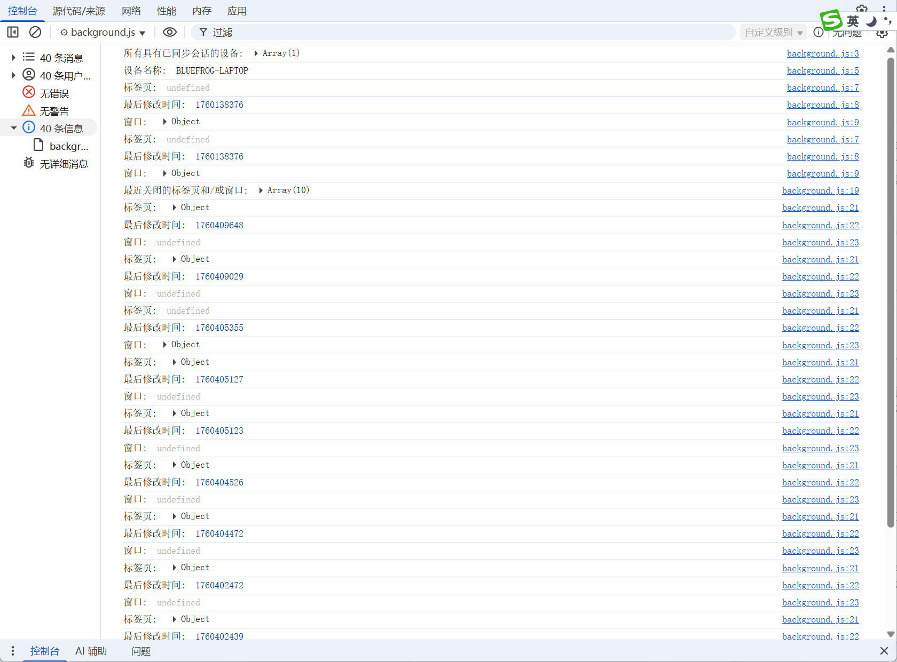

# chrome.sessions 查询和恢复浏览会话中的标签页和窗口

> 使用 `chrome.sessions` API 查询用户最近关闭的标签页 / 窗口，并恢复它们，也可以访问其他设备上的已同步标签页。
> 该 API 需要 `sessions` 权限。

## manifest.json 配置

```json
{
    "manifest_version": 3,
    "name": "查询和恢复浏览会话中的标签页和窗口 展示 (chrome.sessions)",
    "permissions": [
        "sessions"
    ],
    "background": {
        "service_worker": "js/background.js"
    }
}
```

## Session / Tab / Window

```javascript
// Session
{
    lastModified: 1759218545123, // 会话最后修改时间（毫秒）
    tab: { ... },                // 如果会话是一个标签页
    window: { ... }              // 如果会话是一个窗口
}

// Tab
{
    sessionId: "123",
    url: "https://example.com",
    title: "示例页面",
    favIconUrl: "https://example.com/favicon.ico",
    active: false,
    pinned: false,
    windowId: 1,
    index: 0
}
```

## 方法

### getRecentlyClosed()
> 获取最近关闭的会话（标签页 / 窗口）
```javascript
const sessions = await chrome.sessions.getRecentlyClosed({
    maxResults: 25 // 返回数量上限，默认 25
});
for (const session of sessions) {
    if (session.tab) {
        console.log("最近关闭的标签页:", session.tab.title, session.tab.url);
    } else if (session.window) {
        console.log("最近关闭的窗口，包含标签页数:", session.window.tabs.length);
    }
}
```

### restore()
> 恢复最近关闭的会话；不传参数时恢复最近关闭的那一个
```javascript
// 恢复最近关闭的标签页 / 窗口
const restored = await chrome.sessions.restore();
console.log("已恢复:", restored);

// 恢复指定的会话
await chrome.sessions.restore("123"); // 传入 sessionId
```

### getDevices()
> 获取其他已同步设备上打开的标签页（需要用户登录并开启同步）
```javascript
const devices = await chrome.sessions.getDevices({
    maxResults: 10 // 每台设备返回的会话数上限，默认 25
});
for (const device of devices) {
    console.log("设备名称:", device.deviceName);
    for (const session of device.sessions) {
        console.log("  -", session.tab?.title, session.tab?.url);
    }
}
```

## 事件

### onChanged
> 会话（最近关闭的标签页 / 窗口）发生变化时触发
```javascript
chrome.sessions.onChanged.addListener(() => {
    console.log("会话已变化，可重新调用 getRecentlyClosed()");
});
```

## 项目
> https://github.com/freewu/plugin-demo/blob/main/chrome-extension-demo/demo16/


## 资料
```
https://developer.chrome.com/docs/extensions/reference/api/sessions?hl=zh-cn
https://github.com/GoogleChrome/chrome-extensions-samples/tree/main/api-samples/sessions
```
