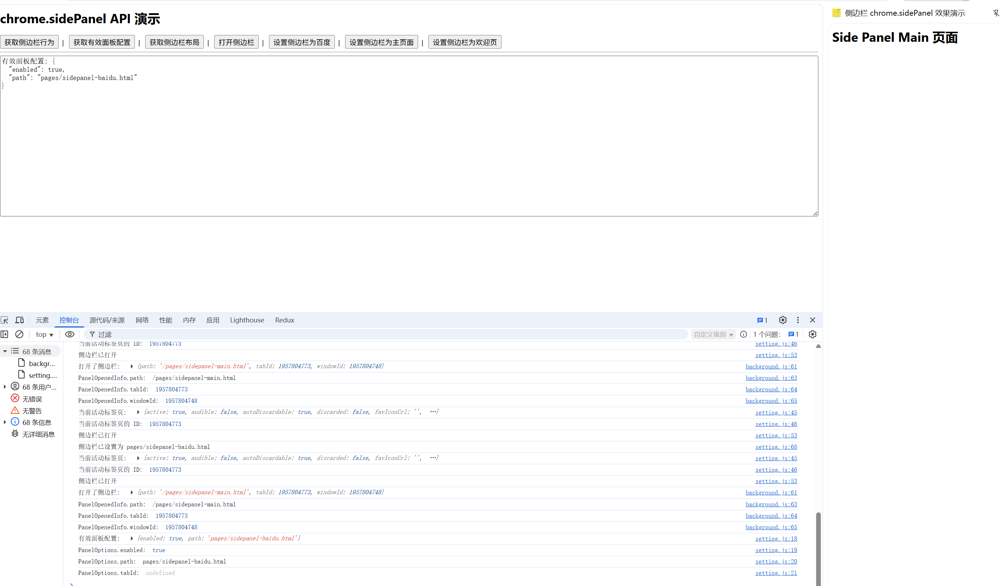

# chrome.sidePanel 侧边栏展示

> 使用 `chrome.sidePanel` API 在浏览器侧边栏中展示扩展程序提供的界面。
> 侧边栏与当前窗口中的所有标签页共享，适合展示书签、笔记、AI 助手等常驻内容。
> 该 API 需要 `sidePanel` 权限。

## manifest.json 配置

```json
{
    "manifest_version": 3,
    "name": "侧边栏 chrome.sidePanel 效果演示",
    "permissions": [
        "sidePanel",
        "tabs"
    ],
    "side_panel": {
        "default_path": "pages/sidepanel.html"
    },
    "action": {
        "title": "侧边栏 chrome.sidePanel 效果演示",
        "default_icon": "images/icon.png"
    },
    "background": {
        "service_worker": "js/background.js"
    }
}
```

## 方法

### setOptions()
> 配置侧边栏行为（全局或针对某个标签页）
```javascript
// 全局配置：点击扩展图标时打开侧边栏
await chrome.sidePanel.setOptions({
    path: "pages/sidepanel.html",
    enabled: true
});

// 针对某个标签页配置
await chrome.sidePanel.setOptions({
    tabId: 123,
    path: "pages/sidepanel.html",
    enabled: true
});
```

### getOptions()
> 获取侧边栏配置
```javascript
const options = await chrome.sidePanel.getOptions({ tabId: 123 });
console.log(options.path, options.enabled);
```

### setPanelBehavior()
> 设置侧边栏的显示行为
```javascript
await chrome.sidePanel.setPanelBehavior({
    openPanelOnActionClick: true // 点击扩展程序 action 图标时自动打开侧边栏
});
```

### getPanelBehavior()
> 获取侧边栏行为
```javascript
const behavior = await chrome.sidePanel.getPanelBehavior();
console.log(behavior.openPanelOnActionClick);
```

### open()
> 打开侧边栏（Chrome 118+，必须在用户手势中调用）
```javascript
document.getElementById("open-btn").addEventListener("click", async () => {
    const [tab] = await chrome.tabs.query({ active: true, currentWindow: true });
    await chrome.sidePanel.open({ tabId: tab.id });
});
```

### setSidePanel — 按网站启用侧边栏示例
```javascript
// 只有访问 example.com 时才启用侧边栏
chrome.tabs.onUpdated.addListener(async (tabId, info, tab) => {
    if (!tab.url) return;
    const url = new URL(tab.url);
    if (url.origin === "https://example.com") {
        await chrome.sidePanel.setOptions({
            tabId,
            path: "pages/sidepanel.html",
            enabled: true
        });
    } else {
        await chrome.sidePanel.setOptions({ tabId, enabled: false });
    }
});
```

## 说明

- 侧边栏页面拥有完整的扩展程序页面权限，可以使用 `chrome.*` API，也可以直接操作 DOM。
- 通过 `openPanelOnActionClick: true` 可以替代 popup，实现点击图标打开侧边栏。
- `chrome.sidePanel` 没有专门的事件。

## 项目
> https://github.com/freewu/plugin-demo/blob/main/chrome-extension-demo/demo5/


## 资料
```
https://developer.chrome.com/docs/extensions/reference/api/sidePanel?hl=zh-cn
https://github.com/GoogleChrome/chrome-extensions-samples/tree/main/functional-samples/sample.sidepanel
```
