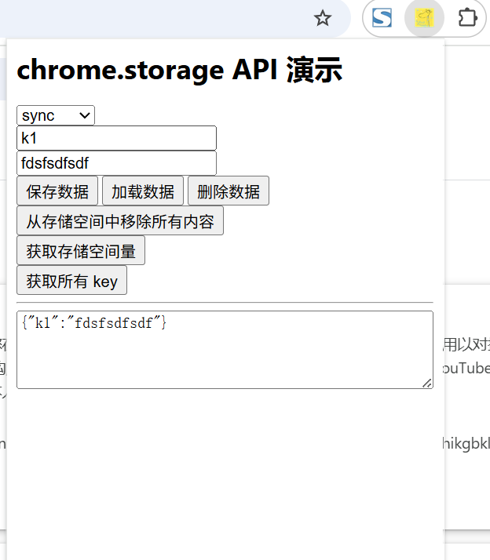

# chrome.storage 数据存储

> 使用 `chrome.storage` API 在扩展程序中持久化存储数据。与 `localStorage` 不同，`chrome.storage` 在 Service Worker 中也可用，并且支持跨扩展程序上下文共享、同步到用户账号等能力。
> 该 API 需要 `storage` 权限（`storage.session` 需要额外声明，Manifest V3）。

## 存储区域

| 区域 | 说明 | 容量 |
| ---- | ---- | ---- |
| `chrome.storage.local` | 存储在本机，扩展程序卸载后清除 | 10MB（可通过 `unlimitedStorage` 扩展） |
| `chrome.storage.sync` | 通过用户账号同步到其他设备 | 总共 100KB，每项 8KB，最多 512 项 |
| `chrome.storage.managed` | 由企业策略设置，只读 | - |
| `chrome.storage.session` | 仅保存在内存中，浏览器关闭即清除，Service Worker 可访问 | 10MB |

## manifest.json 配置

```json
{
    "manifest_version": 3,
    "name": "数据存储 展示 (chrome.storage)",
    "permissions": [
        "storage"
    ],
    "background": {
        "service_worker": "js/background.js"
    }
}
```

## 方法

以下方法对每个存储区域都适用。

### set()
> 保存一个或多个键值
```javascript
await chrome.storage.local.set({
    theme: "dark",
    fontSize: 14
});
console.log("保存成功");

// 同步存储
await chrome.storage.sync.set({ theme: "dark" });
```

### get()
> 读取数据。可以传字符串、字符串数组、对象（含默认值）或空对象（读取全部）
```javascript
// 读取单个键
const { theme } = await chrome.storage.local.get("theme");

// 读取多个键
const data = await chrome.storage.local.get(["theme", "fontSize"]);

// 带默认值
const withDefault = await chrome.storage.local.get({ theme: "light" });

// 读取全部
const all = await chrome.storage.local.get(null);
console.log(all);
```

### remove()
> 删除指定键
```javascript
await chrome.storage.local.remove(["theme", "fontSize"]);
```

### clear()
> 清空该存储区域的所有数据
```javascript
await chrome.storage.local.clear();
```

### getBytesInUse()
> 获取已使用的存储空间字节数
```javascript
const bytes = await chrome.storage.local.getBytesInUse(["theme"]);
console.log("theme 使用字节:", bytes);

// 获取全部使用量
const total = await chrome.storage.local.getBytesInUse(null);
```

### session 区域（Manifest V3）
```javascript
// 默认仅 Service Worker 可访问
await chrome.storage.session.set({ lastActive: Date.now() });

// 若需让内容脚本访问，可设置访问级别
chrome.storage.session.setAccessLevel({
    accessLevel: "TRUSTED_AND_UNTRUSTED_CONTEXTS"
});
```

## 事件

### onChanged
> 存储区域中的数据发生变化时触发
```javascript
chrome.storage.onChanged.addListener((changes, areaName) => {
    console.log("变化的存储区域:", areaName); // local | sync | managed | session
    for (const [key, { oldValue, newValue }] of Object.entries(changes)) {
        console.log("键:", key);
        console.log("旧值:", oldValue);
        console.log("新值:", newValue);
    }
});
```

## 项目
> https://github.com/freewu/plugin-demo/blob/main/chrome-extension-demo/demo11/


## 资料
```
https://developer.chrome.com/docs/extensions/reference/api/storage?hl=zh-cn
https://github.com/GoogleChrome/chrome-extensions-samples/tree/main/api-samples/storage
```
