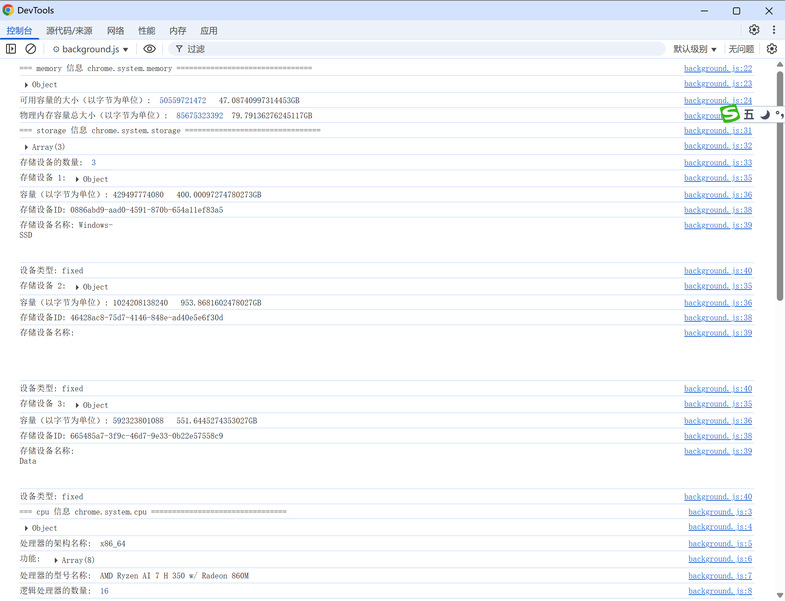

# chrome.system.* 查询 CPU / 内存 / 存储 / 显示器 元数据

> `chrome.system.*` 提供一组系统信息相关 API，用于查询设备的 CPU、内存、存储和显示器信息。
> 各子模块需要分别声明对应权限：`system.cpu`、`system.memory`、`system.storage`、`system.display`。

## manifest.json 配置

```json
{
    "manifest_version": 3,
    "name": "系统信息 展示 (chrome.system.*)",
    "permissions": [
        "system.cpu",
        "system.memory",
        "system.storage",
        "system.display"
    ],
    "background": {
        "service_worker": "js/background.js"
    }
}
```

## chrome.system.cpu

### getInfo()
> 获取 CPU 信息
```javascript
const info = await chrome.system.cpu.getInfo();
console.log("架构:", info.archName);
console.log("型号:", info.modelName);
console.log("核心数:", info.numOfProcessors);
console.log("特性:", info.features);
console.log("各处理器使用率:", info.processors);
// processors[i] = { usage: { user, kernel, idle, total }, temperatures: [...] }
```

## chrome.system.memory

### getInfo()
> 获取内存信息
```javascript
const info = await chrome.system.memory.getInfo();
console.log("总容量(字节):", info.capacity);
console.log("可用容量(字节):", info.availableCapacity);
console.log("已用:", ((info.capacity - info.availableCapacity) / 1024 / 1024).toFixed(1), "MB");
```

## chrome.system.storage

### getInfo()
> 获取所有存储设备信息
```javascript
const units = await chrome.system.storage.getInfo();
for (const unit of units) {
    console.log("设备 ID:", unit.id);
    console.log("名称:", unit.name);
    console.log("类型:", unit.type);         // fixed | removable | unknown
    console.log("总容量:", unit.capacity);
    console.log("可用容量:", unit.availableCapacity);
}
```

### ejectDevice()
> 弹出可移动存储设备
```javascript
await chrome.system.storage.ejectDevice(deviceId).then((result) => {
    console.log("弹出结果:", result); // success | in_use | no_such_device | failure
});
```

### 事件 onAttached / onDetached
```javascript
chrome.system.storage.onAttached.addListener((info) => {
    console.log("新接入存储设备:", info.name);
});
chrome.system.storage.onDetached.addListener((id) => {
    console.log("存储设备已移除:", id);
});
```

## chrome.system.display

### getInfo()
> 获取显示器信息
```javascript
const displays = await chrome.system.display.getInfo();
for (const display of displays) {
    console.log("显示器 ID:", display.id);
    console.log("名称:", display.name);
    console.log("是否主屏:", display.isPrimary);
    console.log("内部:", display.isInternal);
    console.log("分辨率:", display.bounds.width, "x", display.bounds.height);
    console.log("缩放:", display.displayZoomFactor);
}
```

### getDisplayLayout()
> 获取所有显示器的相对布局
```javascript
const layout = await chrome.system.display.getDisplayLayout();
console.log(layout);
```

### setDisplayLayout() / setDisplayProperties()（仅 ChromeOS）
```javascript
// 仅 ChromeOS 可用
await chrome.system.display.setDisplayLayout([
    { id: "display-1", position: "left", offset: 0 }
]);
```

## 项目
> https://github.com/freewu/plugin-demo/blob/main/chrome-extension-demo/demo9/


## 资料
```
https://developer.chrome.com/docs/extensions/reference/api/system/cpu?hl=zh-cn
https://developer.chrome.com/docs/extensions/reference/api/system/memory?hl=zh-cn
https://developer.chrome.com/docs/extensions/reference/api/system/storage?hl=zh-cn
https://developer.chrome.com/docs/extensions/reference/api/system/display?hl=zh-cn
```
