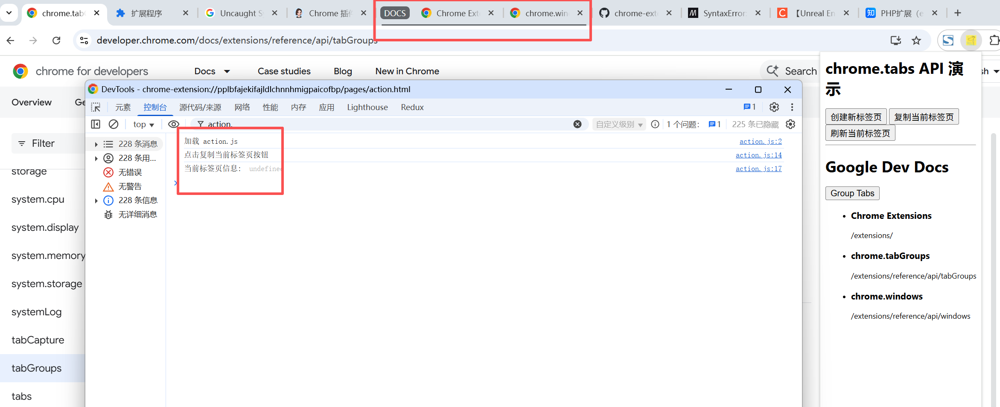

# chrome.tabs 标签页系统进行交互

> 使用 `chrome.tabs` API 与浏览器标签页系统进行交互：创建、查询、更新、移动、重新加载、删除标签页，向内容脚本发送消息等。
> 大多数标签页操作无需特殊权限；但访问标签页的敏感属性（`url`、`pendingUrl`、`title`、`favIconUrl`）需要 `tabs` 权限或对应的主机权限。

## 权限

- `tabs` 权限
    允许读取标签页的敏感属性（`url`、`pendingUrl`、`title`、`favIconUrl`）。
    ```json
    "permissions": ["tabs"]
    ```

- 主机权限
    对匹配的网站，扩展程序无需 `tabs` 权限也能读取敏感属性，并可调用 `captureVisibleTab()`、`scripting.executeScript()` 等。
    ```json
    "host_permissions": ["http://*/*", "https://*/*"]
    ```

- `activeTab` 权限
    用户触发扩展程序时临时授予当前标签页的主机权限，不触发权限警告。
    ```json
    "permissions": ["activeTab"]
    ```

## manifest.json 配置

```json
{
    "manifest_version": 3,
    "name": "标签页 展示 (chrome.tabs)",
    "permissions": [
        "tabs",
        "activeTab",
        "tabGroups"
    ],
    "host_permissions": [
        "http://*/*",
        "https://*/*"
    ],
    "background": {
        "service_worker": "js/background.js"
    }
}
```

## Tab 对象

```javascript
{
    id: 123,                    // 标签页 ID
    index: 0,                   // 在窗口中的索引（从 0 开始）
    windowId: 1,                // 所在窗口 ID
    active: true,               // 是否处于活动状态
    highlighted: true,          // 是否高亮
    pinned: false,              // 是否固定
    discarded: false,           // 是否已被舍弃（从内存卸载）
    autoDiscardable: true,      // 内存不足时是否可自动舍弃
    audible: false,             // 是否正在发声
    mutedInfo: { muted: false },// 静音信息
    incognito: false,           // 是否在无痕窗口
    url: "https://example.com", // 当前 URL（需 tabs 权限）
    pendingUrl: "",             // 待提交的 URL（需 tabs 权限）
    title: "示例页面",           // 标题（需 tabs 权限）
    favIconUrl: "...",          // 网站图标（需 tabs 权限）
    status: "complete",         // unloaded | loading | complete
    groupId: -1                 // 标签页组 ID
}
```

## 方法

### create()
> 创建新标签页
```javascript
const tab = await chrome.tabs.create({
    url: "https://www.example.com",
    active: true,           // 是否激活（默认 true）
    pinned: false,
    index: 0,               // 插入位置
    windowId: 1,            // 目标窗口
    openerTabId: 123        // 打开此标签页的标签页
});
console.log("新标签页 ID:", tab.id);
```

### query()
> 查询标签页
```javascript
// 当前窗口的活动标签页
const [tab] = await chrome.tabs.query({ active: true, currentWindow: true });
console.log(tab.url);

// 查询所有标签页
const allTabs = await chrome.tabs.query({});
// 查询指定窗口的标签页
const windowTabs = await chrome.tabs.query({ windowId: 1 });
// 按 URL 匹配
const matched = await chrome.tabs.query({ url: "https://*.example.com/*" });
```

### get()
> 获取指定标签页
```javascript
const tab = await chrome.tabs.get(123);
console.log(tab.title);
```

### update()
> 更新标签页（如跳转 URL、固定、静音）
```javascript
await chrome.tabs.update(123, {
    url: "https://www.example.com",
    active: true,
    pinned: true,
    muted: true,
    autoDiscardable: false
});
```

### remove()
> 关闭标签页
```javascript
await chrome.tabs.remove(123);
// 关闭多个
await chrome.tabs.remove([123, 124]);
```

### reload()
> 重新加载
```javascript
await chrome.tabs.reload(123, {
    bypassCache: true // 是否跳过缓存
});
```

### move()
> 移动标签页
```javascript
await chrome.tabs.move(123, {
    index: 0,     // 目标位置，-1 表示移动到末尾
    windowId: 1
});
```

### duplicate()
> 复制标签页
```javascript
const newTab = await chrome.tabs.duplicate(123);
```

### captureVisibleTab()
> 捕获当前可见区域的截图（需要主机权限或 activeTab）
```javascript
const dataUrl = await chrome.tabs.captureVisibleTab(
    tab.windowId,
    { format: "png", quality: 90 }
);
console.log(dataUrl); // data:image/png;base64,...
```

### sendMessage()
> 向指定标签页的内容脚本发送消息
```javascript
const response = await chrome.tabs.sendMessage(123, { type: "ping" });
```

### group() / ungroup()
> 将标签页加入 / 移出标签页组
```javascript
// 创建新组
const groupId = await chrome.tabs.group({ tabIds: [123, 124] });
// 加入已有组
await chrome.tabs.group({ tabIds: [125], groupId: 1 });
// 移出组
await chrome.tabs.ungroup([123]);
```

### highlight()
> 高亮（选中）一个或多个标签页
```javascript
const tab = await chrome.tabs.highlight({ tabs: [0, 1] });
```

### discard()
> 舍弃标签页（卸载其内容以释放内存）
```javascript
await chrome.tabs.discard(123);
```

### getZoom() / setZoom()
> 获取 / 设置标签页缩放比例
```javascript
const zoom = await chrome.tabs.getZoom(123);
await chrome.tabs.setZoom(123, 1.5);
```

### detectLanguage()
> 检测页面内容语言
```javascript
const result = await chrome.tabs.detectLanguage(123);
console.log("语言:", result); // "en"、"zh" 等
```

## 事件

### onCreated
> 标签页创建时触发
```javascript
chrome.tabs.onCreated.addListener((tab) => {
    console.log("新标签页:", tab.id, tab.url);
});
```

### onUpdated
> 标签页更新（加载状态、标题、URL 等）时触发
```javascript
chrome.tabs.onUpdated.addListener((tabId, changeInfo, tab) => {
    console.log("标签页更新:", tabId, changeInfo);
    if (changeInfo.status === "complete") {
        console.log("加载完成:", tab.url);
    }
});
```

### onActivated
> 标签页被激活时触发
```javascript
chrome.tabs.onActivated.addListener((activeInfo) => {
    console.log("激活的标签页:", activeInfo.tabId, activeInfo.windowId);
});
```

### onRemoved
> 标签页关闭时触发
```javascript
chrome.tabs.onRemoved.addListener((tabId, removeInfo) => {
    console.log("关闭标签页:", tabId, "窗口是否同时关闭:", removeInfo.isWindowClosing);
});
```

### onMoved
> 标签页移动时触发
```javascript
chrome.tabs.onMoved.addListener((tabId, moveInfo) => {
    console.log("标签页移动:", tabId, moveInfo.fromIndex, "->", moveInfo.toIndex);
});
```

### onHighlighted
> 高亮状态变化时触发
```javascript
chrome.tabs.onHighlighted.addListener((highlightInfo) => {
    console.log("高亮的标签页:", highlightInfo.tabIds);
});
```

### onAttached / onDetached
> 标签页被移动 / 移出窗口时触发
```javascript
chrome.tabs.onAttached.addListener((tabId, attachInfo) => {
    console.log("标签页加入窗口:", tabId, attachInfo.newWindowId);
});
chrome.tabs.onDetached.addListener((tabId, detachInfo) => {
    console.log("标签页离开窗口:", tabId, detachInfo.oldWindowId);
});
```

### onReplaced
> 标签页被替换（如预渲染）时触发
```javascript
chrome.tabs.onReplaced.addListener((addedTabId, removedTabId) => {
    console.log("标签页被替换:", removedTabId, "->", addedTabId);
});
```

### onZoomChange
> 缩放比例变化时触发
```javascript
chrome.tabs.onZoomChange.addListener((zoomChangeInfo) => {
    console.log("缩放变化:", zoomChangeInfo.tabId, zoomChangeInfo.newZoomFactor);
});
```

## 项目
> https://github.com/freewu/plugin-demo/blob/main/chrome-extension-demo/demo10/


## 资料
```
https://developer.chrome.com/docs/extensions/reference/api/tabs?hl=zh-cn
https://developer.chrome.com/docs/extensions/reference/api/tabGroups?hl=zh-cn
https://github.com/GoogleChrome/chrome-extensions-samples/tree/main/functional-samples/tutorial.tabs-manager
```
