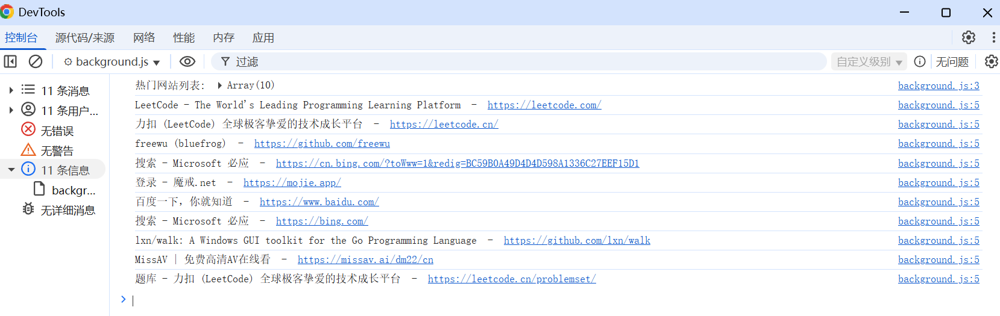

# chrome.topSites 获取访问次数最多的网站

> 使用 `chrome.topSites` API 获取用户访问次数最多的网站（即新标签页中的「最常访问」列表）。
> 该 API 需要 `topSites` 权限。返回的数据是只读的，扩展程序无法修改用户的常用网站。

## manifest.json 配置

```json
{
    "manifest_version": 3,
    "name": "获取访问次数最多的网站 展示 (chrome.topSites)",
    "permissions": [
        "topSites"
    ],
    "background": {
        "service_worker": "js/background.js"
    }
}
```

## 方法

### get()
> 获取访问次数最多的网站列表，最多 12 条
```javascript
const sites = await chrome.topSites.get();
for (const site of sites) {
    console.log("标题:", site.title);
    console.log("网址:", site.url);
}
```

```javascript
// 回调写法
chrome.topSites.get((sites) => {
    sites.forEach((site) => {
        console.log(site.title, site.url);
    });
});
```

## MostVisitedURL 对象

```javascript
{
    title: "示例网站",           // 网站标题
    url: "https://example.com"   // 网站网址
}
```

## 使用示例：在新标签页中展示常用网站

```javascript
chrome.topSites.get((sites) => {
    const container = document.getElementById("top-sites");
    sites.forEach((site) => {
        const a = document.createElement("a");
        a.href = site.url;
        a.textContent = site.title;
        container.appendChild(a);
    });
});
```

## 说明

- 返回的列表最多 12 个网站，具体数量取决于用户的历史记录。
- 无痕模式下不返回数据。
- 该 API 没有事件。

## 项目
> https://github.com/freewu/plugin-demo/blob/main/chrome-extension-demo/demo15/


## 资料
```
https://developer.chrome.com/docs/extensions/reference/api/topSites?hl=zh-cn
https://github.com/GoogleChrome/chrome-extensions-samples/tree/main/api-samples/topSites
```
