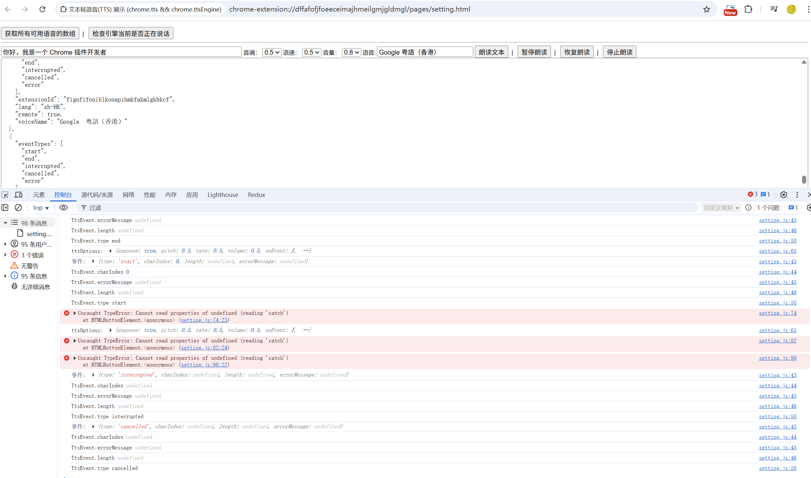

# chrome.ttsEngine 通过扩展程序实现文本转语音(TTS) 引擎

> 使用 `chrome.ttsEngine` API 通过扩展程序实现自定义的文本转语音引擎。
> 当用户或其他扩展程序调用 `chrome.tts.speak()` 时，注册了 TTS 引擎的扩展程序会收到事件，从而可以接管语音合成。
> 该 API 需要 `ttsEngine` 权限。一个扩展程序同时只能有一个 TTS 引擎处于活动状态。

## manifest.json 配置

```json
{
    "manifest_version": 3,
    "name": "文本转语音(TTS) 展示 (chrome.tts && chrome.ttsEngine)",
    "permissions": [
        "tts",
        "ttsEngine"
    ],
    "background": {
        "service_worker": "js/background.js"
    }
}
```

## 方法

### updateVoices()
> 更新该引擎提供的语音列表，供 `chrome.tts.getVoices()` 查询
```javascript
chrome.ttsEngine.updateVoices([
    {
        voiceName: "My Voice",
        lang: "zh-CN",
        eventTypes: ["start", "end", "word", "error"],
        remote: false,
        extensionId: chrome.runtime.id
    }
]);
```

### sendTtsEvent()
> 向调用方发送 TTS 事件（用于报告朗读进度）
```javascript
chrome.ttsEngine.sendTtsEvent(utteranceId, {
    type: "end",      // start | end | word | sentence | mark | interrupt | cancel | error
    charIndex: 0
});
```

## 事件

### onSpeak
> 有文本需要合成时触发
```javascript
chrome.ttsEngine.onSpeak.addListener((utterance, options, sendTtsEvent) => {
    console.log("需要朗读:", utterance);
    console.log("选项:", options); // rate、pitch、volume、lang、voiceName 等

    // 通知开始
    sendTtsEvent({ type: "start", charIndex: 0 });

    // 在这里执行语音合成（例如调用本地服务或 Web Audio）
    synthesize(utterance).then(() => {
        sendTtsEvent({ type: "end", charIndex: utterance.length });
    }).catch((error) => {
        sendTtsEvent({ type: "error", errorMessage: error.message });
    });
});
```

### onSpeakWithAudioStream
> 支持音频流式输出的 TTS 事件（Chrome 92+），与 `onSpeak` 类似但可返回音频流
```javascript
chrome.ttsEngine.onSpeakWithAudioStream.addListener(
    async (utterance, options, audioStreamOptions, sendTtsAudio, sendTtsEvent) => {
        console.log("需要合成音频流:", utterance);
        console.log("音频流参数:", audioStreamOptions); // sampleRate、bufferSize 等

        sendTtsEvent({ type: "start", charIndex: 0 });

        const audioBuffer = await synthesizeToBuffer(utterance);
        sendTtsAudio({
            audioBuffer: audioBuffer,
            charIndex: 0,
            isLastBuffer: true
        });

        sendTtsEvent({ type: "end", charIndex: utterance.length });
    }
);
```

### onStop
> 收到停止朗读请求时触发
```javascript
chrome.ttsEngine.onStop.addListener(() => {
    console.log("停止朗读");
    // 停止当前的合成任务
});
```

### onPause
> 收到暂停请求时触发
```javascript
chrome.ttsEngine.onPause.addListener(() => {
    console.log("暂停朗读");
});
```

### onResume
> 收到继续请求时触发
```javascript
chrome.ttsEngine.onResume.addListener(() => {
    console.log("继续朗读");
});
```

## 说明

- 引擎扩展程序安装后，用户可以在系统或扩展程序设置中选择该 TTS 引擎。
- `eventTypes` 声明了该语音支持哪些事件类型，`chrome.tts` 会据此决定是否等待 `end` 事件。
- 若需要通过音频流播放，请实现 `onSpeakWithAudioStream` 并声明支持事件类型 `"audioStream"`。

## 项目
> https://github.com/freewu/plugin-demo/blob/main/chrome-extension-demo/demo44/


## 资料
```
https://developer.chrome.com/docs/extensions/reference/api/ttsEngine?hl=zh-cn
https://github.com/GoogleChrome/chrome-extensions-samples/tree/main/api-samples/ttsEngine
```
