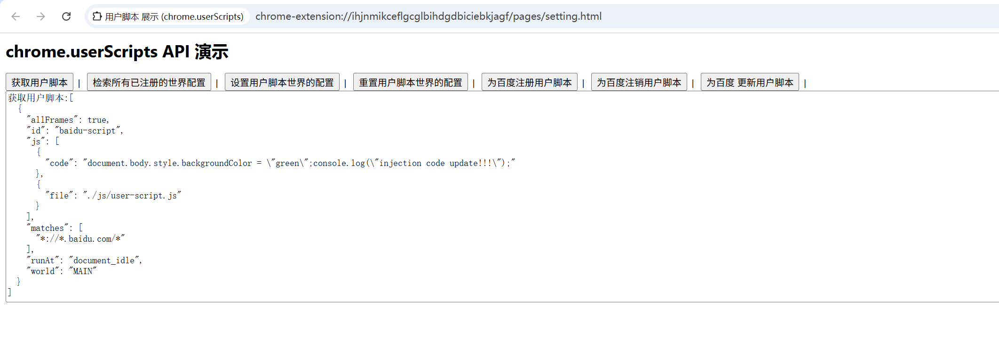

# chrome.userScripts 在用户脚本上下文中执行用户脚本

> 使用 `chrome.userScripts` API 在「用户脚本」上下文中执行脚本。
> 与内容脚本不同，用户脚本运行在用户可控制的独立世界（user script world）中，常用于 Tampermonkey 一类的脚本管理器。
> 该 API 需要 `userScripts` 权限。用户还需要在 `chrome://extensions` 中为扩展程序开启「允许用户脚本」（开发者模式下）。
> Chrome 120+ 起支持 `chrome.userScripts.configureWorld()` 来配置用户脚本世界。

## manifest.json 配置

```json
{
    "manifest_version": 3,
    "name": "用户脚本 展示 (chrome.userScripts)",
    "permissions": [
        "userScripts"
    ],
    "host_permissions": [
        "<all_urls>"
    ],
    "background": {
        "service_worker": "js/background.js"
    }
}
```

## 方法

### getScripts()
> 获取已注册的用户脚本
```javascript
const scripts = await chrome.userScripts.getScripts({
    // ids: ["script-1"], // 可选，按 ID 过滤
    // includeInactive: true
});
console.log(scripts);
```

### register()
> 注册用户脚本
```javascript
await chrome.userScripts.register([{
    id: "my-user-script",
    matches: ["https://*.example.com/*"],
    js: [{ file: "js/user-script.js" }],
    // 或内联代码: js: [{ code: "document.body.style.background='red';" }],
    runAt: "document_idle",           // document_start | document_end | document_idle
    world: "USER_SCRIPT",             // USER_SCRIPT | MAIN（默认 USER_SCRIPT）
    allFrames: false
}]);
```

### unregister()
> 注销用户脚本
```javascript
await chrome.userScripts.unregister({ ids: ["my-user-script"] });
// 注销全部
await chrome.userScripts.unregister();
```

### update()
> 更新已注册的用户脚本
```javascript
await chrome.userScripts.update([{
    id: "my-user-script",
    matches: ["https://*.example.org/*"]
}]);
```

### configureWorld()
> 配置用户脚本世界（Chrome 120+）
```javascript
await chrome.userScripts.configureWorld({
    messaging: true,           // 允许用户脚本使用 chrome.runtime.sendMessage
    csp: "script-src 'self'",  // 用户脚本世界的内容安全策略
    // worldId: "custom-world" // 自定义世界 ID
});
```

### getWorldConfigurations()
> 获取世界配置
```javascript
const configs = await chrome.userScripts.getWorldConfigurations();
console.log(configs);
```

### resetWorldConfiguration()
> 重置世界配置
```javascript
await chrome.userScripts.resetWorldConfiguration();
```

## 事件

### onBeforeScript / onUserScriptsMessage

> 监听用户脚本消息（需先 `configureWorld({ messaging: true })`）
```javascript
chrome.runtime.onUserScriptMessage.addListener((message, sender, sendResponse) => {
    console.log("来自用户脚本的消息:", message, sender.id);
    sendResponse({ ok: true });
    return true;
});

chrome.runtime.onUserScriptConnect.addListener((port) => {
    console.log("用户脚本建立了连接:", port.name);
});
```

## 说明

- 用户脚本需要用户手动开启「允许用户脚本」开关（在扩展详情页开发者模式中），否则调用会失败。
- 用户脚本默认运行在 `USER_SCRIPT` 世界，可通过 `world: "MAIN"` 运行在页面主世界。
- 与内容脚本一样，用户脚本的匹配需要 `host_permissions`。

## 项目
> https://github.com/freewu/plugin-demo/blob/main/chrome-extension-demo/demo40/


## 资料
```
https://developer.chrome.com/docs/extensions/reference/api/userScripts?hl=zh-cn
https://github.com/GoogleChrome/chrome-extensions-samples/tree/main/api-samples/userScripts
```
