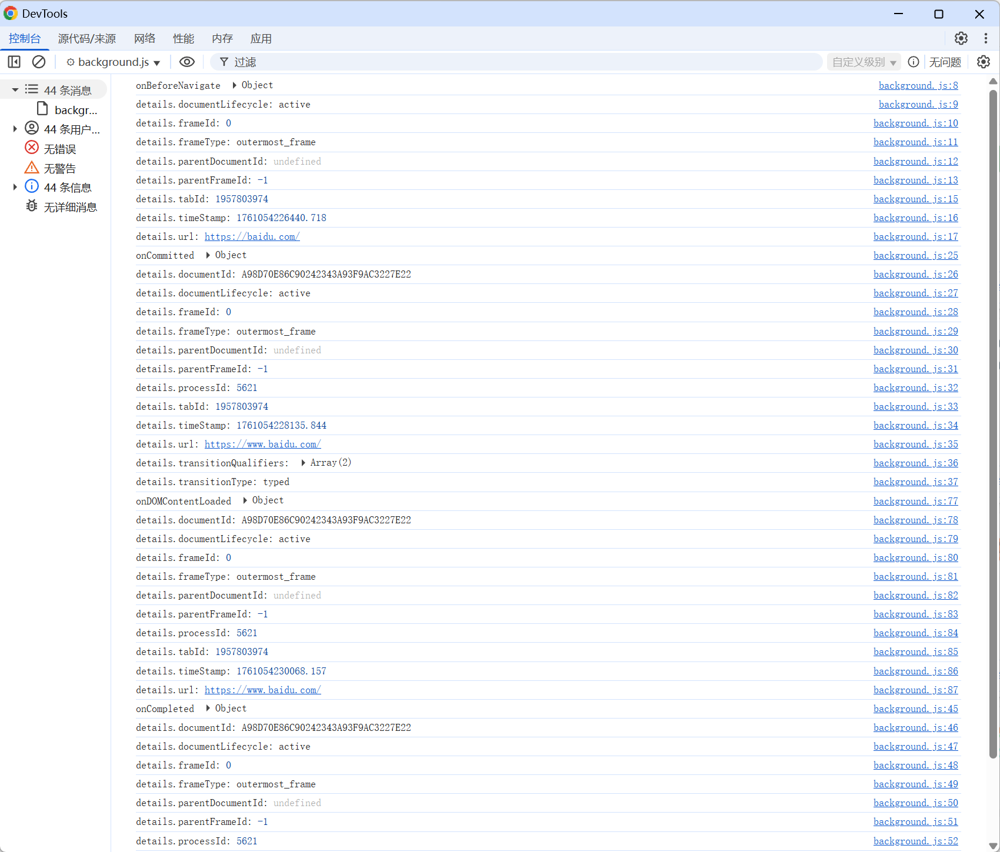

# chrome.webNavigation 接收有关正在处理的导航请求的状态的通知

> 使用 `chrome.webNavigation` API 接收有关导航请求各个阶段的状态通知：即将导航、开始、DOM 加载完成、加载完成、出错、历史状态更新、重定向等。
> 与 `chrome.webRequest` 不同，`webNavigation` 关注的是「导航」这一高层事件，且不会修改请求。
> 该 API 需要 `webNavigation` 权限。

## manifest.json 配置

```json
{
    "manifest_version": 3,
    "name": "接收有关正在处理的导航请求的状态的通知 展示 (chrome.webNavigation)",
    "permissions": [
        "webNavigation",
        "tabs"
    ],
    "background": {
        "service_worker": "js/background.js"
    }
}
```

## 导航详情对象

大多数事件都会回传一个 `details` 对象：

```javascript
{
    tabId: 123,                    // 标签页 ID
    frameId: 0,                    // 框架 ID，0 表示主框架
    parentFrameId: -1,             // 父框架 ID
    url: "https://example.com",    // 目标网址
    timeStamp: 1759218545123,      // 事件时间
    transitionType: "link",        // 跳转类型
    transitionQualifiers: [...],   // 跳转限定符
    processId: 1,
    documentId: "...",             // Chrome 106+
    documentLifecycle: "active"    // active | prerender
}
```

## 方法

### getFrame()
> 获取指定框架的信息
```javascript
const frame = await chrome.webNavigation.getFrame({
    tabId: 123,
    frameId: 0,               // 与 processId 二选一
    // processId: 1
});
if (frame) {
    console.log("框架 URL:", frame.url);
    console.log("父框架:", frame.parentFrameId);
}
```

### getAllFrames()
> 获取标签页内所有框架的信息
```javascript
const frames = await chrome.webNavigation.getAllFrames({ tabId: 123 });
for (const frame of frames) {
    console.log("框架 ID:", frame.frameId);
    console.log("URL:", frame.url);
    console.log("是否在主框架中:", frame.parentFrameId === -1);
}
```

## 事件

### onBeforeNavigate
> 导航即将开始时触发（此时还没有请求）
```javascript
chrome.webNavigation.onBeforeNavigate.addListener((details) => {
    console.log("即将导航:", details.url, "frameId:", details.frameId);
});
```

### onCommitted
> 导航已提交（响应已开始，文档正在加载）时触发
```javascript
chrome.webNavigation.onCommitted.addListener((details) => {
    console.log("导航已提交:", details.url);
    console.log("跳转类型:", details.transitionType);
});
```

### onDOMContentLoaded
> 页面 DOM 加载完成时触发
```javascript
chrome.webNavigation.onDOMContentLoaded.addListener((details) => {
    console.log("DOM 加载完成:", details.url);
});
```

### onCompleted
> 页面完全加载完成时触发
```javascript
chrome.webNavigation.onCompleted.addListener((details) => {
    console.log("页面加载完成:", details.url);
});
```

### onErrorOccurred
> 导航过程中出错时触发
```javascript
chrome.webNavigation.onErrorOccurred.addListener((details) => {
    console.error("导航出错:", details.url, details.error); // error 为 net::ERR_* 字符串
});
```

### onCreatedNavigationTarget
> 由脚本或用户操作创建了新的导航目标（如 window.open）时触发
```javascript
chrome.webNavigation.onCreatedNavigationTarget.addListener((details) => {
    console.log("新导航目标:");
    console.log("  源标签页:", details.sourceTabId);
    console.log("  新标签页:", details.tabId);
    console.log("  URL:", details.url);
});
```

### onReferenceFragmentUpdated
> URL 的片段标识符（#hash）变化时触发
```javascript
chrome.webNavigation.onReferenceFragmentUpdated.addListener((details) => {
    console.log("hash 变化:", details.url);
});
```

### onHistoryStateUpdated
> 使用 History API（pushState / replaceState）更新历史状态时触发
```javascript
chrome.webNavigation.onHistoryStateUpdated.addListener((details) => {
    console.log("history 状态更新:", details.url);
});
```

### onTabReplaced
> 标签页被另一个标签页替换（如预渲染）时触发
```javascript
chrome.webNavigation.onTabReplaced.addListener((details) => {
    console.log("标签页被替换:", details.replacedTabId, "->", details.tabId);
});
```

## 项目
> https://github.com/freewu/plugin-demo/blob/main/chrome-extension-demo/demo35/


## 资料
```
https://developer.chrome.com/docs/extensions/reference/api/webNavigation?hl=zh-cn
https://github.com/GoogleChrome/chrome-extensions-samples/tree/main/api-samples/webNavigation
```
