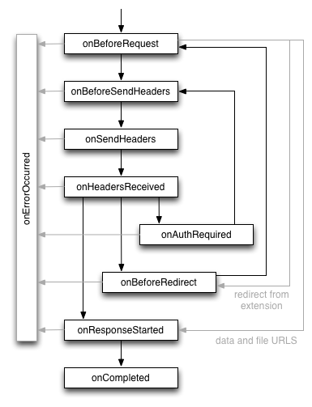

# chrome.webRequest 观察和分析流量，并拦截、屏蔽或修改正在处理的请求

> 使用 `chrome.webRequest` API 观察和分析网络流量，也可以在阻塞模式下拦截、屏蔽或修改正在处理的请求。
> 由于 Manifest V3 的安全限制，**阻塞式 webRequest** 仅对通过企业政策安装的扩展程序开放；普通扩展程序应改用 `chrome.declarativeNetRequest` 来屏蔽 / 修改请求。
> 观察模式需要 `webRequest` 权限，并需要目标主机的 **主机权限**。

## manifest.json 配置

```json
{
    "manifest_version": 3,
    "name": "观察和分析流量 展示 (chrome.webRequest)",
    "permissions": [
        "webRequest"
    ],
    "host_permissions": [
        "https://*/*",
        "http://*/*"
    ],
    "background": {
        "service_worker": "js/background.js"
    }
}
```

> 阻塞模式（`webRequestBlocking`）在 Manifest V3 中仅限企业政策安装的扩展程序使用。

## RequestFilter

事件监听器可传入过滤器，精确控制监听范围：

```javascript
{
    urls: ["https://*.example.com/*"], // URL 匹配模式
    types: ["main_frame", "sub_frame", "xmlhttprequest", "image", "script", "stylesheet"],
    tabId: 123,          // 限定标签页
    windowId: 1,         // 限定窗口
    initiatorDomains: ["example.com"],
    requestDomains: ["example.com"]
}
```

## 方法

### handlerBehaviorChanged()
> 通知浏览器监听器行为发生变化，清除内部缓存（例如动态修改了阻塞规则后调用）
```javascript
chrome.webRequest.handlerBehaviorChanged(() => {
    console.log("缓存已清除");
});
```

## 事件

### onBeforeRequest
> 请求即将发出前触发，可在此取消或重定向请求（阻塞模式）
```javascript
chrome.webRequest.onBeforeRequest.addListener(
    (details) => {
        console.log("请求:", details.method, details.url);
        console.log("请求类型:", details.type);
        console.log("请求体:", details.requestBody);

        // 阻塞模式下可返回 { cancel: true } 或 { redirectUrl: "..." }
        // return { cancel: true };
    },
    { urls: ["<all_urls>"] },
    ["blocking"] // 普通 MV3 扩展程序不能使用 blocking
);
```

### onBeforeSendHeaders
> 请求头即将发送前触发，可读取 / 修改请求头（阻塞模式）
```javascript
chrome.webRequest.onBeforeSendHeaders.addListener(
    (details) => {
        for (const header of details.requestHeaders) {
            console.log(header.name, ":", header.value);
        }
        // 阻塞模式: return { requestHeaders: details.requestHeaders };
    },
    { urls: ["<all_urls>"] },
    ["requestHeaders", "blocking"]
);
```

### onSendHeaders
> 请求头已发送时触发
```javascript
chrome.webRequest.onSendHeaders.addListener(
    (details) => console.log("已发送请求头:", details.url),
    { urls: ["<all_urls>"] },
    ["requestHeaders"]
);
```

### onHeadersReceived
> 收到响应头时触发，可读取 / 修改响应头（阻塞模式）
```javascript
chrome.webRequest.onHeadersReceived.addListener(
    (details) => {
        console.log("状态码:", details.statusCode);
        console.log("响应头:", details.responseHeaders);
    },
    { urls: ["<all_urls>"] },
    ["responseHeaders"]
);
```

### onBeforeRedirect
> 发生重定向时触发
```javascript
chrome.webRequest.onBeforeRedirect.addListener(
    (details) => {
        console.log("重定向:", details.url, "->", details.redirectUrl);
    },
    { urls: ["<all_urls>"] }
);
```

### onResponseStarted
> 收到响应主体第一个字节时触发
```javascript
chrome.webRequest.onResponseStarted.addListener(
    (details) => console.log("响应开始:", details.statusCode, details.url),
    { urls: ["<all_urls>"] }
);
```

### onCompleted
> 请求成功完成时触发
```javascript
chrome.webRequest.onCompleted.addListener(
    (details) => console.log("请求完成:", details.url, details.statusCode),
    { urls: ["<all_urls>"] }
);
```

### onErrorOccurred
> 请求失败时触发
```javascript
chrome.webRequest.onErrorOccurred.addListener(
    (details) => console.error("请求失败:", details.url, details.error),
    { urls: ["<all_urls>"] }
);
```

### onAuthRequired
> 收到 401 或 407 需要身份验证时触发，可提供凭据（阻塞模式）
```javascript
chrome.webRequest.onAuthRequired.addListener(
    (details, callback) => {
        callback({ authCredentials: { username: "user", password: "pass" } });
    },
    { urls: ["<all_urls>"] },
    ["blocking"]
);
```

## 改用 declarativeNetRequest

在 Manifest V3 中，推荐使用声明式规则屏蔽 / 修改请求：

```json
{
    "permissions": ["declarativeNetRequest"],
    "host_permissions": ["<all_urls>"]
}
```

```javascript
chrome.declarativeNetRequest.updateDynamicRules({
    addRules: [{
        id: 1,
        priority: 1,
        action: { type: "block" },
        condition: { urlFilter: "||ads.example.com", resourceTypes: ["script", "image"] }
    }],
    removeRuleIds: [1]
});
```

## 项目
> https://github.com/freewu/plugin-demo/blob/main/chrome-extension-demo/demo34/


## 资料
```
https://developer.chrome.com/docs/extensions/reference/api/webRequest?hl=zh-cn
https://developer.chrome.com/docs/extensions/reference/api/declarativeNetRequest?hl=zh-cn
https://github.com/GoogleChrome/chrome-extensions-samples/tree/main/api-samples/webRequest
```
