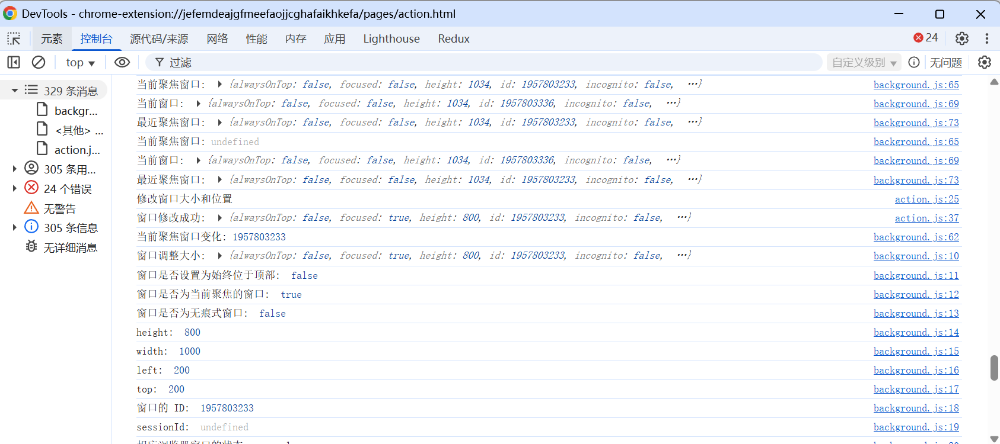

# chrome.windows 在浏览器中创建、修改和重新排列窗口

> 使用 `chrome.windows` API 在浏览器中创建、查询、修改和关闭窗口，控制窗口大小、位置、焦点等。
> 大多数功能无需特殊权限；若要访问窗口内标签页的敏感信息（如 URL），则需要 `tabs` 权限。

## manifest.json 配置

```json
{
    "manifest_version": 3,
    "name": "查询和恢复浏览会话中的标签页和窗口 展示 (chrome.windows)",
    "permissions": [
        "windows",
        "tabs"
    ],
    "background": {
        "service_worker": "js/background.js"
    }
}
```

## Window 对象

```javascript
{
    id: 1,                       // 窗口 ID
    focused: true,               // 是否获得焦点
    alwaysOnTop: false,          // 是否置顶（部分平台）
    incognito: false,            // 是否无痕窗口
    type: "normal",              // normal | popup | panel | app | devtools
    state: "normal",             // normal | minimized | maximized | fullscreen | locked-fullscreen
    left: 0, top: 0,             // 位置
    width: 1200, height: 800,    // 尺寸
    tabs: [ ... ]                // 窗口中的标签页（需 tabs 权限）
}
```

## 方法

### get()
> 获取指定窗口
```javascript
const win = await chrome.windows.get(1, {
    populate: true,     // 是否填充 tabs 属性
    windowTypes: ["normal"]
});
console.log(win.id, win.state, win.tabs.length);
```

### getCurrent()
> 获取当前脚本所在窗口
```javascript
const win = await chrome.windows.getCurrent({ populate: true });
console.log("当前窗口:", win.id);
```

### getLastFocused()
> 获取最近获得焦点的窗口
```javascript
const win = await chrome.windows.getLastFocused();
console.log("最近聚焦的窗口:", win.id);
```

### getAll()
> 获取所有窗口
```javascript
const windows = await chrome.windows.getAll({
    populate: true,
    windowTypes: ["normal", "popup"]
});
for (const win of windows) {
    console.log(win.id, win.type, win.tabs.length);
}
```

### create()
> 创建新窗口
```javascript
const win = await chrome.windows.create({
    url: "https://www.example.com",
    type: "normal",        // normal | popup | panel
    state: "normal",       // normal | minimized | maximized | fullscreen
    focused: true,
    width: 800,
    height: 600,
    left: 100,
    top: 100,
    incognito: false,
    // 创建包含多个标签页的窗口
    // url: ["https://a.com", "https://b.com"]
});
console.log("新窗口 ID:", win.id);
```

### update()
> 更新窗口的属性、位置、大小、状态
```javascript
await chrome.windows.update(1, {
    focused: true,      // 聚焦
    state: "maximized", // 最大化
    // left: 0, top: 0,
    // width: 1024, height: 768,
    // drawAttention: true // 引起注意（闪烁任务栏）
});
```

### remove()
> 关闭窗口
```javascript
await chrome.windows.remove(1);
```

## 事件

### onCreated
> 窗口创建时触发
```javascript
chrome.windows.onCreated.addListener((window) => {
    console.log("新窗口:", window.id, window.type);
});
```

### onRemoved
> 窗口关闭时触发
```javascript
chrome.windows.onRemoved.addListener((windowId) => {
    console.log("窗口已关闭:", windowId);
});
```

### onFocusChanged
> 窗口焦点变化时触发
```javascript
chrome.windows.onFocusChanged.addListener((windowId) => {
    if (windowId === chrome.windows.WINDOW_ID_NONE) {
        console.log("所有窗口都失去焦点");
    } else {
        console.log("获得焦点的窗口:", windowId);
    }
});
```

### onBoundsChanged
> 窗口位置或大小变化时触发（节流事件）
```javascript
chrome.windows.onBoundsChanged.addListener((window) => {
    console.log("窗口边界变化:", window.id, window.left, window.top, window.width, window.height);
});
```

## 使用示例：在新窗口中打开当前标签页

```javascript
chrome.action.onClicked.addListener(async (tab) => {
    const win = await chrome.windows.create({
        url: tab.url,
        focused: true,
        width: 900,
        height: 700
    });
    console.log("已在新窗口打开:", win.id);
});
```

## 项目
> https://github.com/freewu/plugin-demo/blob/main/chrome-extension-demo/demo19/


## 资料
```
https://developer.chrome.com/docs/extensions/reference/api/windows?hl=zh-cn
https://github.com/GoogleChrome/chrome-extensions-samples/tree/main/api-samples/windows
```
